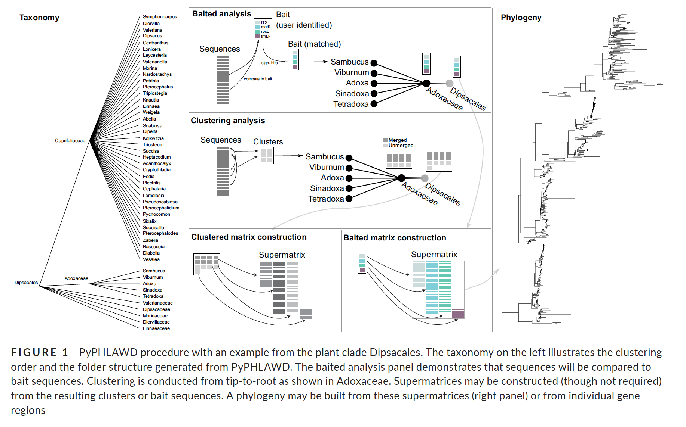

background-image: url(https://github.com/LunaSare/PyPHLAWD/raw/master/pyphlawd_log.png)
background-position: 80% 75%
background-size: 350px

```{r setup, include=FALSE}
options(htmltools.dir.version = FALSE)
knitr::opts_chunk$set(echo = FALSE)
options(knitr.duplicate.label = 'allow')
```

class: center, middle, blue-gray

.font3.gray[**PyPHLAWD: A python tool for phylogenetic dataset construction**.]
.font2[[Smith & Walker (2019). Methods in Ecology and Evolution, 10(1):104–108](https://besjournals.onlinelibrary.wiley.com/doi/abs/10.1111/2041-210X.13096) .gray[paper discussion.]]

.left[
<br/>
### **`r params$author`**
### `r params$institute`
<br/><br/>
`r params$event`

`r params$date` &#183; `r params$place`

Last updated on  `r Sys.Date()`. Find the code for these slides [`r anicon::faa("github", animate="passing")` here](https://github.com/lunasare/papers/blob/master/smith2019pyphlawd.Rmd).
]
---
class: split-20

.row.gray[.content.left.vmiddle[
# Introduction
]]

.row.split-40[
.row.split-two[
.column[.content.center.vmiddle[
## Phylogenies are important <br/> and we need them!
]]

.column[.content.center.vmiddle[
## In particular, large phylogenies, <br/> why?
]]
]

.row.light-blue[
]
]

---
class: split-20

.row.gray[.content.left.vmiddle[
# Introduction
]]

.row.split-40[
.row.split-two[
.column[.content.center.vmiddle[
## Phylogenies are important <br/> and we need them!
]]

.column[.content.center.vmiddle[
## In particular, large phylogenies, <br/> why?
]]
]

.row.light-blue[.content.center.font2[
Large phylogenies .indigo[=] well sampled phylogenies .indigo[≈] 

phylogenies containing all species within a clade 

.indigo[Which are ideal for downstream analyses, **so we want these!**]
]]
]

---
class: split-20

.row[.content.vmiddle[
# .amber[**Problem!**] Generating large phylogenies is hard, costly, and takes time...
]]

.row[
]

---
class: split-20

.row[.content.vmiddle[
# .amber[**Problem!**] Generating large phylogenies is hard, costly, and takes time...
]]

.row.split-two[
.column[.content.center[
<br/><br/>
# .teal[A solution] <br/><br/> .purple[*Automatized*] processing of <br/>vast amounts of already *publicly <br/> available* molecular data <br/>(GenBank).
]]
.column[.content.center.font_medium[
<br/><br/>
Tools currently available for that:

• [SUPERSMART](http://www.supersmart-project.org/) go to [paper](https://academic.oup.com/sysbio/article/66/2/152/2418028)

• [PHLAWD](https://github.com/blackrim/phlawd) go to [paper](https://bmcevolbiol.biomedcentral.com/articles/10.1186/1471-2148-9-37)

• [Phylota](http://ceiba.biosci.arizona.edu/pb/) go to [paper](https://academic.oup.com/sysbio/article/57/3/335/1661098)

• [Phylogenerator](https://willpearse.github.io/phyloGenerator/index.html) go to [paper](https://besjournals.onlinelibrary.wiley.com/doi/10.1111/2041-210X.12055)

]]
]

---
class: split-50

.column[.content.center[
<br/> <br/> 
# .deep-orange[Next problem!] <br/><br/> Full automation is not ideal. <br/><br/>  Human intervention improves the quality of the phylogenetic reconstruction...
]]

.column[

]


---
class: split-50

.column[.content.center[
<br/> <br/> 
# .deep-orange[Next problem!] <br/><br/> Full automation is not ideal. <br/><br/>  Human intervention improves the quality of the phylogenetic reconstruction...
]]

.column[.content.center[
<br/><br/>
# .lime[A solution:] PyPHLAWD


]]


???
The authors use the term phylogenetic datasets often: "process [...] data in order to create phylogenetic datasets" I think they are referring to molecular data alignments that can be used for phylogenetic reconstruction.

Image credit: [Steven Smith](https://github.com/FePhyFoFum/PyPHLAWD/blob/master/docs/assets/img/logo.gif)

---
class: bg-black, left, white, split-10

.row[.content[
# The PyPHLAWD workflow
]]
.row.split-two[
.column.split-1-2-1[
.row.bg-gray.black[.content[
- (1) A preassembled database of DNA sequences, which can be generated in two different ways:
  - assembled locally with .amber[phlawd_db_maker] script available from its [github repo](https://github.com/blackrim/phlawd_db_maker). 
  - downloaded from PyPHLAWD's [website](http://141.211.236.35:10998/).
]]
.row[.content.vmiddle[
- (2) Two types of analyses for sequence searching can be performed:
  - .cyan[baited]: the user provides bait sequence
files for each single gene, containing full length sequences
for several species (e.g., 10–20) across the clade of interest, that will be used to filter sequences from the DNA database.
  - .color-main3[clustered]: all-by-all BLAST analyses along with markov clustering analyses (MCL) are conducted to identify clusters.
]]
.row.bg-gray.black[.content[
- (3) Once gene regions are identified, the sequences are saved in independent files within folders corresponding to the taxonomy of the sequence.
  - .lime[Whole genomes are set aside] in an independent folder and are excluded from further analyses.
]]
]
.column.split-1-2-1[
.row[.content[
- (4) .pink[Sequence similarity analyses] are then performed, starting at the tips of the taxonomy.
  - what kind of sequence similarity analyses?
]]
.row.bg-gray.black[.content.vmiddle[
- (5) A configuration file allows customizing different elements of the workflow, such as:
  - .yellow[Excluding from gene search] misidentified taxa, sequences with "bad" patterns, and/or sequences smaller than a certain minimum size.
  - Customizing options for the .indigo[BLAST analysis].
]]
.row[.content[
- (6) To perform a phylogenetic reconstruction using a supermatrix (i.e., concatenated gene regions), clusters with .teal[at least 20% taxon sampling and at least 20 taxa] are selected as good clusters for a concatenated analysis.
]]
]
]
---
class: split-20 

.row[.content.vmiddle[
# A PyPHLAWD workflow real life example: .color-main3[the Dipsacales]
]]

.row.split-two.bg-main1.center[
.column[.content[
.font_medium[General info from [Wikipedia](https://en.wikipedia.org/wiki/Dipsacales)]
<div class="resp-container">
    <iframe class="testiframe" src="https://en.wikipedia.org/wiki/Dipsacales" width="500px" height="400px">
      A wikipedia page
    </iframe>
</div>
]]
.column[.content[
.font_medium[Some phylogenetic data from [tolweb](http://tolweb.org/Dipsacales)]
<div class="resp-container">
    <iframe class="testiframe" src="http://tolweb.org/Dipsacales" width="500px" height="400px">
      A tolweb page
    </iframe>
</div>
]]
]
---
background-image: url(smith2019pyphlawd_files/original-paper-figs/fig1.png)
background-position: 50% 75%
background-size: 900px

.content[
# A PyPHLAWD workflow real life example: .color-main3[the Dipsacales]
]

<!--  -->

<br/><br/><br/><br/><br/><br/><br/><br/><br/><br/><br/><br/><br/><br/><br/><br/><br/><br/><br/><br/><br/><br/>
.center[Parameters used: .blue[smallest_size = 400], .lime[length_limit = 0.55], and .purple[perc_identity = 20]]

???
Original figure from MEE published paper. Hosted in this repo.

---
# A PyPHLAWD workflow real life example: .blue[Results]
<br/>
.font_medium[As of 04/11/18, there are 33,178 sequences available in GenBank representing 864 taxa for the Dipsacales.]
<br/><br/>

```{r message=FALSE, results='asis'}
library(kableExtra)
results <- read.csv(file = "papers/smith2019pyphlawd_files/data/software-comparison.csv")
colnames(results)[3] <- "# of gene clusters"
colnames(results)[5] <- "trnL-trnF"
colnames(results)[8] <- "Total taxa"
colnames(results)[9] <- "concat."
colnames(results)[10] <- "Adoxaceae taxa"
colnames(results)[11] <- "concat."

# t0 <- knitr::kable(results, escape = FALSE, row.names = FALSE, format = "html", align = "c")
# kableExtra::kable_styling(kable_input = t0) %>%
# column_spec(1, width = "2cm") -> t0
# return(t0)
library(DT)
datatable(results, class = 'order-column hover compact row-border', options = list(dom = 't'), rownames = FALSE, editable = TRUE) %>%
  formatStyle('Software',  color = 'black', backgroundColor = 'white', fontWeight = 'bold', autoWidth = TRUE)
```
---
class: bg-cyan
# Questions for discussion:<br/>

.font2[
Why are there differences in results between software?

How often are these tools used? 

Would you use them? 

Which one would you use?

What do you think about the sequence searching process?
]

---
class: center, middle

# References

Slides created via the R package [**xaringan**](https://github.com/yihui/xaringan).

The chakra comes from [remark.js](https://remarkjs.com), [**knitr**](http://yihui.name/knitr), and [R Markdown](https://rmarkdown.rstudio.com).
