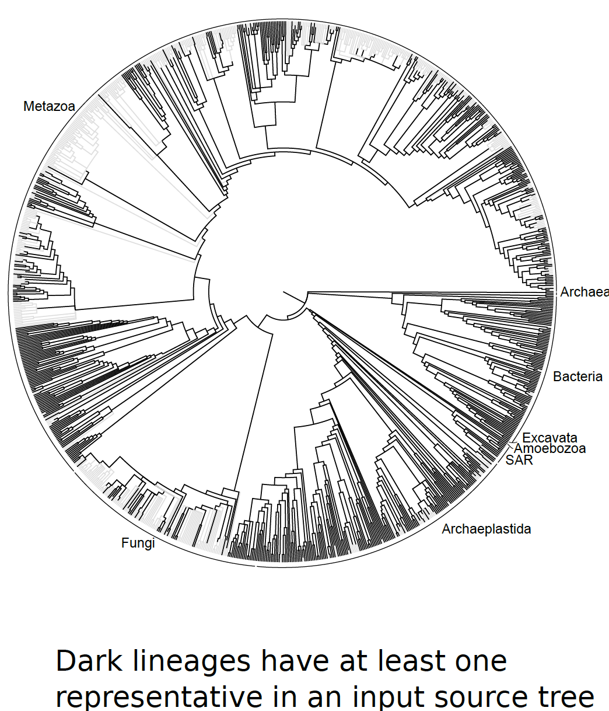
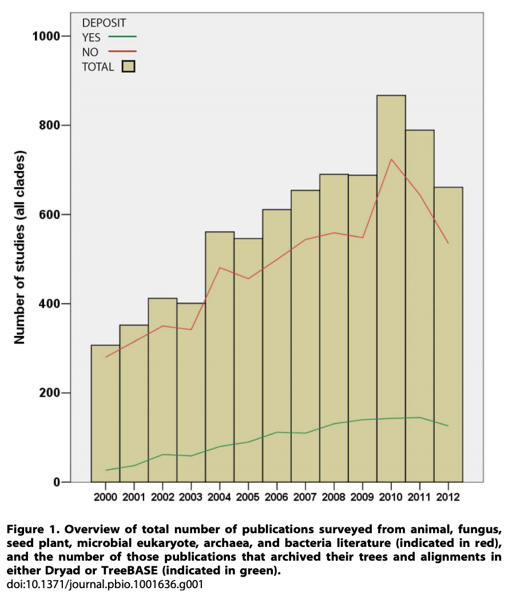
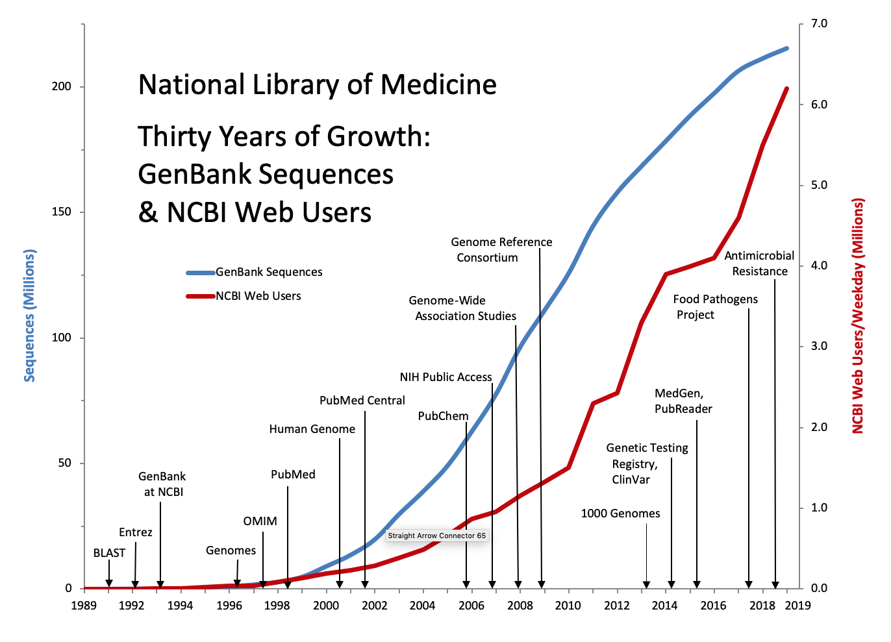

background-image: url("bg/4-diversity2.png")
background-position: center
background-size: contain

class: left, center, black

```{r setup, include=FALSE}
options(htmltools.dir.version = FALSE)
knitr::opts_chunk$set(echo = FALSE)
options(knitr.duplicate.label = 'allow')
```

.font3[**Physcraper**]

.font2[Continual .red[updating] of evolutionary estimates in the Open Tree of Life]

<br/>
### .red[<sup>*</sup>] `r params$authorA` .red[&#8226;]  `r params$authorB` .red[&#8226;] `r params$authorC`

### &nbsp; &nbsp; `r params$institute`
<br/>

`r params$event`
<br/>
`r params$date` .red[&#8226;] `r params$place`

<br/>

Slides last updated on  `r format(Sys.Date(), format = "%B %d, %Y")` .red[&#8226;] Find the code for them in [`r anicon::faa("github", animate="passing")` here](https://lunasare.github.io/slides/talks/2020sbe.html#1)
---
background-image: url("bg/1-gradient1.png")
background-position: center
background-size: contain

class: left, black


# .red[<sup>*</sup>] About the speaker

## https://www.lunasare.com/

## Contact: .pink[@LunaSare] on [Github `r anicon::faa("github", animate="float")`](https://github.com/LunaSare) and [Twitter `r anicon::faa("twitter", animate="float")`](https://twitter.com/LunaSare)

---
background-image: url("bg/1-gradient1.png")
background-position: center
background-size: contain

class: left, black


# What is it?
---
background-image: url("assets/2-data-2723105_1920.jpg")
background-position: center
background-size: cover

class: center white

<br/><br/><br/><br/>
.font3[We have a challenge ...]
--


---
background-image: url("bg/1-gradient.png")
background-position: center
background-size: contain

class: center

<br/><br/><br/><br/>
.font3[How can we stay up to date with the .blue[massive] amount of new .orange[data],
while taking advantage of the already existing .orange[knowledge]?]


---
background-image: url("assets/4-diversity1.png")
background-position: center
background-size: contain

???

# As biologists, we want to understand how all living things are connected evolutionarily

---
background-image: url("bg/4-diversity2.png")
background-position: center
background-size: contain

class: split-20, center

.row[.content[
# Let's talk scale... .orange[how many] organisms are there?

]]
.row.split-two[
.column[.content.center[
<br/><br/><br/>
### &emsp; &emsp; &emsp;  Estimates range between
## &emsp; &emsp; &emsp; .orange[3 million] .font_small.gray[(Mayr 2010)]
### &emsp; &emsp; &emsp;  and
## &emsp; &emsp; &emsp; .blue[100 million] .font_small.gray[(Mora et al. 2011)]
### &emsp; &emsp; &emsp; living species
]]

.column[.content.center[
<br/><br/>
### 99.9% of species that have ever &emsp; &emsp;
### existed have gone extinct &emsp; &emsp;
## .font_small.gray[(Mayr 1997)] &emsp; &emsp;
<br/>
### How many more species have  &emsp; &emsp;
### existed in the past??? &emsp;
.font4[`r emo::ji("scream")` &emsp; ]
]]
]

???
# There are a gazillion species living, and many more so extinct
# It is a problem for big data management and analysis

# 3 million seconds are 34 days and 16 hrs
# 100 million seconds are 3 years and 62 days
> x <- 999*3000000
> min <- x/60
> min
[1] 49950000
> hrs <- min/60
> hrs
[1] 832500
> days <- hrs/24
> days
[1] 34687.5
> yrs <- days/365
> yrs
[1] 95.03425
considering a conservative estimate, there are 95 years and 11 days worth of extinct Species
and considering a bold estimate, there are:
((((999*100000000)/60)/60)/24)/365
3 617 years and 294 days ~ almost 4 millenia worth of extinct species
---
background-image: url("assets/6-gradient1.png")
background-position: center
background-size: contain
class: split-60



.column.split-two[
.row[.content[

]]
.row[.content.left[
### &emsp; &emsp; The  .green[Open Tree of Life] project - Released .green[2012]
### &emsp; &emsp; At [https://tree.opentreeoflife.org](https://tree.opentreeoflife.org/opentree/argus/opentree12.3@ott93302)
<br/>
### &emsp; &emsp; Has information from .blue[`r rotl::tol_about()$num_source_trees` analyses] - *phylogenies*
### &emsp; &emsp; Covers almost .amber[90 K species]

]]
]
.column[.content.left[
<br/><br/><br/><br/><br/><br/><br/><br/>
<br/><br/><br/><br/><br/><br/><br/><br/>
<br/><br/><br/><br/><br/><br/>
.gray[Figure 1C from Hinchliff et al. 2015)]
]]

---
background-image: url("assets/6-gradient1.png")
background-position: center
background-size: contain
class: split-10



.column[
]
.column.split-40[
.column[.content.left[
<br/><br/><br/>
# Total number of
# published
# analyses -*phylogenies*
# is around the .amber[10 K's]
]]
.column[.content.left[
<br/><br/><br/><br/><br/><br/><br/><br/>
<br/><br/><br/><br/><br/><br/><br/><br/>
<br/><br/><br/><br/><br/><br/><br/><br/><br/><br/>
&emsp; .gray[Figure from Drew et al. 2013]
]]
]

???

Graphs of accumulation of phylogenies through time


---
background-image: url("bg/11-data-sharing-orange.png")
background-position: center
background-size: contain

## There might be some *data* &nbsp; sharing issues...

???

Main: Sharing is key for reuse of phylogenies; and reuse is key for advancement of science.

Conclusion: Phylogenies are usually not shared but DNA data is
(Drew et al. 2013).
---

class: split-10 center

.row.bg-black.white[.content.vmiddle.left[
# How can we get a .blue[published] phylogeny?
]]
.row.split-two[
.row.split-four[
.column[.content.vmiddle[
## Files in reusable data format--
## Supplementary Data in Journals
]]
.column[.content[

]]
.column.bg-black.white[.content[


.font_small.gray[Figure 1c from Hinchliff et al. 2015]
]]
.column.bg-black.white[.content.vmiddle[
## Figures on
## published papers
.gray[A pdf/jpg/png file]
]]
]
.row.split-two[
.column.bg-black.white[.content.vmiddle[
## Asking the authors

]]
.column[.content.vmiddle[
## Reanalyzing the raw data


]]
]
]

---
background-image: url("bg/12-molecular-gray.png")
background-position: 50% 0%
background-size: contain

# Getting the .blue[**raw data**]
## .gray[*Molecular sequence repositories*]
### The International Nucleotide Sequence Database Collaboration (INSDC)

<br/>

### &emsp; &#183; .gray[GenBank] at the National Center for Biotechnology
### Information (NCBI) - Released .gray[ 1989]
### https://www.ncbi.nlm.nih.gov/genbank/

<br/>

### &emsp; &#183; DNA DataBank of Japan (.gray[DDBJ]) - Released .gray[1986]
### https://www.ddbj.nig.ac.jp/index-e.html

<br/>

### &emsp; &#183; European Nucleotide Archive (.gray[ENA]) - Released .gray[1982]
### https://www.ebi.ac.uk/ena


???

More effort is going to share the raw molecular data
https://www.ddbj.nig.ac.jp/stats/release-e.html#total_data
---
background-image: url("bg/13-compare-gray.png")
background-position: center
background-size: contain

# Public .blue[**molecular data**] is in the order of .orange[**trillions**]
#### Figure from https://www.ddbj.nig.ac.jp/stats/release-e.html#total_data

---
background-image: url("bg/1-gray.png")
background-position: 50% 0%
background-size: 100%

# Let's *zoom in* into the .blue[**GenBank database**]
#### &emsp; &emsp; &emsp; &emsp; Figure from https://www.nlm.nih.gov/about/2021CJ.html

<a href="https://www.nlm.nih.gov/about/2021CJ.html">

</a>

<a href="https://www.ncbi.nlm.nih.gov/nucleotide/">

</a>

---
background-image: url("bg/1-gradient.png")
background-position: center
background-size: contain

class: center

<br/><br/><br/><br/>
.font3[How do we go about
this .blue[massive] amount of raw .orange[data]?]


---
background-image: url("bg/1-gradient.png")
background-position: center
background-size: contain

class: split-70 center

.column.split-20[
.row[.content.vmiddle[
# The dawn of the phylogenetic .blue[pipeline]
]]
.row.split-two[
.column[.content.vmiddle[
[Phylota](http://ceiba.biosci.arizona.edu/pb/) - Sanderson et al. 2008

[Amphora](https://phylogenomics.me/software/amphora/) - Wu et al. 2008

[PHLAWD](https://github.com/blackrim/phlawd) - Smith et al. 2009

[PUmPER](https://github.com/fizquierdo/perpetually-updated-trees) - Izquierdo et al. 2014

[DarwinTree](http://www.darwintree.cn/index.shtml) - Meng et al. 2014

[NCBIminer](https://code.google.com/archive/p/ncbiminer/) - Xu et al. 2015

[SUMAC](https://github.com/wf8/sumac) - Freyman et al. 2015

[STBase](https://journals.plos.org/plosone/article?id=10.1371/journal.pone.0117987) - McMahon et al. 2015
]]
.column[.content.vmiddle[
[BIR](https://journals.sagepub.com/doi/10.4137/EBO.S10189?icid=int.sj-full-text.similar-articles.2) - Kumar et al. 2015

[SUPERSMART](https://academic.oup.com/sysbio/article/66/2/152/2418028) - Antonelli et al. 2017

[SOPHI](https://onlinelibrary.wiley.com/doi/abs/10.1111/1755-0998.12256) - Chesters et al. 2017

[PhyloSkeleton](https://bitbucket.org/lionelguy/phyloskeleton/src/master/) - Guy et al. 2017

[OneTwoTree](http://onetwotree.tau.ac.il/) - Drori et al. 2018

[PhylotaR](https://docs.ropensci.org/phylotaR/) - Bennett et al. 2018

[pyPHLAWD](https://fephyfofum.github.io/PyPHLAWD/) - Smith et al. 2019

[Phylotol](https://bio.tools/PhyloToL) - Ceron et al. 2019
]]
]
]
.column.bg-blue[.content.vmiddle[

]]

???
Pipelines for using data from molecular databases

Efforts to make sense of this data: massive data pipelines

https://i.redd.it/hk7eo05svd351.jpg cats
https://i.redd.it/ez4zn3esgyw41.png brains
---
background-image: url("bg/1-gradient.png")
background-position: center
background-size: contain

class: split-20 center

.row[.content.vmiddle[
# The phylogenetic .blue[pipeline]
]]
.row.split-two[
.column.split-10[
.column[
]
.column[.content.vmiddle[
# The good `r emo::ji("raised_hands")`
<br/>
### Fill and "fix" phylogenetic knowledge on the tree of life.
<br/>
### A stride towards reproducibility in the field.
]]
]
.column[.content.vmiddle[
# The bad `r emo::ji("fearful")`
<br/>
### Phylogenetic pipelines are not fully relied by community.
<br/>
### Manual curation always makes
### for better phylogenies!
<br/>
### It is hard to maintain software...

]]
]
---
background-image: url("bg/1-gray.png")
background-position: center
background-size: contain

class: split-20

.row[.content.vmiddle[
# &emsp; Getting the .blue[**curated molecular data**] (in reusable format)
## &emsp; &emsp; *Curated molecular data for phylogenetic analyses repository*
]]

.row.split-60[
.column[.content.vmiddle[
### &emsp; &emsp; &emsp;  .indigo[TreeBASE] database - Released .indigo[1994]
<br/>
### &emsp; &emsp; [https://treebase.org/treebase-web/home.html](https://treebase.org/treebase-web/home.html)
<br/>
### &emsp; &emsp; If the TreeBASE webpage is lagging, go [here](https://treebase.org/treebase-web/home.html) for a demo.
]]
.column[.content[
<br/><br/><br/><br/><br/><br/><br/><br/><br/><br/><br/><br/><br/><br/><br/><br/><br/><br/>
<p style="font-size:0.75em; position:relative; right:20%; bottom:2%;">
<a href="https://www.linuxjournal.com/content/party-its-1994">
&emsp; &emsp; &emsp; &emsp; &emsp; &emsp; &emsp; &emsp; &emsp; &emsp; &emsp; &emsp; www.linuxjournal.com
</a> </p>
]]
]


<img src="data:image/jpeg;base64,/9j/4AAQSkZJRgABAQAAAQABAAD/2wCEAAkGBxITEBMSEhEWFRUWGRUbGBcXGRgVFxUYFxcXFxUVFxUYHSggHRslHRUVITEiJSkrLi4uFx8zODMsNygtLisBCgoKDg0OGxAQGy0lHyItLS0wLy0tLS0tLS0tLSstLS01LS0tLS0tLS0tLS0tLS0tLS0tLS0tLS0rKy0tLS0tK//AABEIAOEA4QMBIgACEQEDEQH/xAAcAAEAAwEBAQEBAAAAAAAAAAAABQYHBAEDAgj/xAA8EAABAwIDBQUFBgYCAwAAAAABAAIDBBEFBiESMUFRYQcTIjJxQlJigbEUcpGhweEWIzRUktE1ghUksv/EABoBAQADAQEBAAAAAAAAAAAAAAABAwQCBQb/xAAqEQACAgEEAQQBAwUAAAAAAAAAAQIDEQQSITETIkFCUWEyM3EUIyQ0of/aAAwDAQACEQMRAD8AgERF9CeSEREAREQBERAEREAREQBERAEREAREQBERAEREAREQBERAEREAREQBERAEREAREQBERAEREAREQBERAEREAREQBERAEREAREQBERAEREAREQBERAEREAREQBERAEREAREUEhXnI2TDMRPUNtGPKw+31PReZGyaZiJ5xaMatYfa6notOqqiOGMveQxjBv3AAcFg1Op+MTTVT8pEHjmTqeeItawMcPK4C1isgxTDpKeQxSts4fg4cwtdyxnSCse9jbscD4Q7228COu/RdWacuR1kRaRZ48ruIP8ApU03yre2ZZZUprMTDUXXimHSU8pilFnDdycOYXIvVTTWUYmsBERSQEREAREQBERAEREAREQBERAEREAREQBERAERFACvGRcnGYionaRGPK0+1yJHJMi5NMxE87bRjVrT7XU9Fp1VUxwxl7yGMYNTuAAWDU6n4RNVNPykKmojhiLnuDGMG/cABwWMZwzS+ufsi7adp8Ld23bc53TomcM0vrn2bdtO0+Fvv29pygFOm02PVIi67Ppiexvc1zXscWubq1zdCD0Wv5FzeKtvdSaTtGtho4D2gsnw+hknkEcbbuP5dVs2U8sx0kfAyEeJ36Domt2Jc9k6fdn8H1zTlyOsis4APHldxB/0sXxTDpKeV0UrSHA/Jw4ELeTicPfCDvG94RfYvrZR2acuR1kRa7R48ruIPL0WfT3uviXRZbUpcrswxF1Yph0lPKYpW2cPwI5hcq9ZST6MTWAiIpICIiAIiIAiIgCIiAIiIAiIgCIiAIiIArxkXJxlInqG2jHladNrqeirWX56SOUSVZOy03DA0uuetloUfafh4AA2wOWwdAsepsn+mKNFMIvmTLjU1EcMZe9wYxg1J0ACxjN+aX1z9lt207T4W7ts++7/AEmcM0yVz7C7advlb73xO6dFALjT6bHql2Tddn0oLow+hkmkbHG0lxPDh1K57K8ZWzXhlGy13ukPmdsHfyC03WOC4XJVCKk+S7ZSyzHSR7gZD5nfoFyZ3zcykZ3cZDp3Dwj3fiKh8U7UIDERTBzpDuuLAdVm08rnvMkjtp7tSTr8lhqolZLdM0ztjBYift9VKZe+Mh7299viDe/4dFrWRs4NqmiKWzZ2jUe+B7Q66ahZAvY3ua5r2Etc03aRvBWu7TxnHCKK7nFm5Zpy5HWRWcLPHldxBWL4ph0lPK6KVpDgfk4cCFfsI7T4WxAVQcJBoS0XD/i6LizNm7DKyPZdth48rtg6HgD0WaiVlctrXBdbGE1lMoaIfW/VF6RkCIiEBERAEREAREQBF04bTd7NHF77rab9VPYrk8QyFrq2mYOAkcQ75gBVysjF4bO1GT5wVhFY6HJ7pnbMNbSyOHBriT9F+KvKvdOLJa+kY8b2ucQR+S580Psnxy+ivorNh2THTOtFWU0nMMcSbdBZQWI07Y5XxtNw0kXPMb11GyMnhM5cWuzmREVhyEREJCIigBFZ6HItTK0OY+Igi+/dfmvvN2eVLBd88DR8RIVTurXDaO1XL2RUUVrlyBVgbTXRyDmw3+qrldRSQv2JWFjuR49V1GyEuE0cuLXaOdEX2paV8jgyNhc47gF03jkhI+KKazDlyWkEZkIO2NbcDyUKkZKSyg008MIisuGZLqJI+9eWwx7yZDbTn6KJTjH9TwSot9FaRXCmybDNcU1dFI8bwCoiuy5JDOIJpY4ydQ9xsz8VwroPjJ145L2IZFb4ezmqeA5s0DgdxBJB/JfObIM7DZ9TTtPIuIP0Ueev7Hjn9FURW2Hs9qX+Sop3fdcT+iruL4a+nmdDIQXNtfZ3arqNsZPCZDhJcs5ERFZg4OzCcSNPKJWsDnAHZvwPArjnPePdI/xOcbknXfwCIFzsWdzOtz6Lb2WxgVmgA8J3C3BRmeYmmvmu0HXl0Ut2X/1n/U/RRmd/6+b1/RZoped/wXP9pERhc/cTxzMGsbg6w0DrcDZeVc23I+Qi224uty2jeykMt4SypmETphGTuBF9roFY8WyfTxVLWPnEUbgLXNy88fRWysrhPns4UJSX4KOinM14TDBM2OCTvNoDQHa1J01CT4bT0wb9sfeRwuIG+YDmXDQLryxwmc7GQaKz0mBU9XBJLRPIdF54nXJGl96gKChkmkEUbbvPDTTmSeCRsjLL+g4NHOimp2UEDzHI907x5yy7Qw8RfiujF8utbTMrKaTvIH24EFt+ahWxbx9k+NpEv2SuInkG04gjcTcfJd/bG28dNqR43bjbhxUf2Uf1D/RWftDwJ1U2ENkYzZcT4yBe44XWKW1ajk0Ry6uCpdl2ISR1Jh2nOjePK4k7LuYJ+itfadQsfSF5sHNIs7j6L45Kyl9mLpzI2V9rANIsPmqv2gY7UzO7mSB0MTTfXXbcNxDuScSvzAdV+oqAWgdltCAZKp5AaLNaToAb2OqoAaToN50HqVdM2y/ZqGlpWmziWySAf5fVatRlrYu2U1YT3P2Ld2jYb31GXAax+IWWOBbzhNQKqjY46h7NViOL0ZhnliO9rj+BOip0cu4Ms1C6kSuRKBs1dG14BaASR1GoV27VoZDSM7u4YHfzAPdss4wLFDS1DJwL7OhHwnzH8FuFDWwVcIcwtkY8aj14ELnUtxsUn0TSk4OK7MBpHuie2SI7D2m4I0v623qw5zxyKs7h7blzWkSAi1j0VszH2dNdtSUx2Xb9g7j0HJZtVUz43lkjS1zd4Kvg67ZKS7RVJTgsM1rssv8A+Pbck+J+/wBVSu1GO9eNXeQbiRxV17LP+Pb99/1UZnbKclRVd42VjRs2s4gHf1WSDjG97ui+SbrWDO8Jq308zJmOf4CCRtGxHEEKRzdicdTVumiN2uay99PEBqrTFlb7LQVL5HMe8jS1iG/MLO2bgttbjOW6PtwZ57oxwz9IiK8q4CBEUklw7L/6z/qfoozO/wDXzev6KX7K4HGqLw07IGp4KLz7C5tdKXNIDjcHmsaf+Q/4L2v7SObKI/8Aep/vhSvai0Gu11GyFGZOYTXQWBNnC9uAUt2oMIrbkGxaLHgVMv8AYRCz4uDh7O8NY+tj00b4rb76afmujMuPWrJg6jhcQ613A3PK6j8nYoKesje82jJs48r6D87Kz5+ys90n2qnb3jX+YN1N+BC4ntV2JdY4JjnZmJCYfnaSBrhDSQs2t5AIv6qa7P4/5VXVlodIQbDgL7wOiqNJglQ8n+U5jW6uc7RrQOJVp7NcRjbJNSyPFpB4Pddzt6pbCMYvaTXJuXJXBmBv9jB+BXVVZzlfTmmbTxRxkWs0HQdOq9zNlOenmdsRufETdpbrYcio3/w8ojdLI3u2DcX6bZ5NCsjCuSTz/wBOZOayi0dk/wDUP9F39ssQcymuL+N3/wArm7KaSQSyPLCG23kWHyUz2p4ZJLDE6Nhd3biSBqdRZZpNf1GWXJPxYKFkzFZaepjDHnu3GzmX0tzHVbBmDDY6ime17QbtJHMG1wQsoyjl6eWpYTG5rGm7nOFh6DqtPzTjDKencL3kc2zGDVxJ0GnJRqdqsWwU52PcZbk7CO9rmxm5bGSSeWydLqwZkzBhklS8TQyPey7CW2t4eS7clYVLBSVFQ+MiWUOIb7Q0/VZrOx+0TI0tedSDvuVcl5p99Fb9EOuzY8jY3SzRuipmuYGey7fbmOiqPaphmxO2cbnjX1GgXD2cSSMrQWscWvGy4gXA46rQ89YSaike1ou5viA4kt1sPVUcU3d8Fn7lfRi7KZ5a54adltrngLr6YZiM1M7bp5CzW5b7DvvK6dnVIXNqqadpbtgWDtD1t6Ks47lyelkLXMJb7LwLgjhuWzyQnJwZn2ySUkadkjNwrWlj2hkzPMODh7zeihO1fDm7Mc4FnDQnmDuuo/svwqUVLp3NLWBhbc6X13ar6dpWMieRtNB/M2NX7OtjwCyRgoX4i+DQ5OVfPZYey3/j2/ff9VS+0+/28eIjwDieavXZtSvjoWtkaWkucbHfYm4VY7TMEndVNljic9pbbw62N0rcXe8iafiWCs4Tj5hp5qd4e9so0N9GH/ShmhSdNl+re4NbTv14kWAvzVizjhrKOjp6ewMjyS53HRbN0ISxH3M7UpLL9iloiK/kqygvWOIII3jUcfyXiKSSVjzRXt8s7G/djA/HVfiozHWyAiSZjgd94xf5FRqKrwwzk63y6Oyhxipgv3EjWX3ksDj8jwX1qMxVsgtJMx43axi/yKjkUuqLefcb3jB4QNylsMzPW042YZ/B7rxt/gVFIplXGSwyIycXlEjieYKuoFpphs+6wbF/vEbwo624glpG4jQj0K8ul1ChGKwg5NvLJ2mzriLG7Ama4WsNpgJHqeKjK7Ep5nB80m2RuAFmD/ouZFCpgnnBPkk+ya/jDEbbIqGNA3bMYH466r9R52xMC32lh9Y7/qoNFHgg/YlWSXuTE2bsRcLGoaByazZ+hUdDXTNk71spMnvP8YHoCue45r0FSqYL2I8kn7kv/F2I/wB0P8P3UfW1ssz9uZwc+1rgbOnovgimNcIvgiU21yd1BjdVAC2CUMB1Phub+q6f4uxL+6H+H7qHulxzUOmD5aJVklxk7Z8ZqnvbI6bxt8paNn8eak4c74gBZ0kcg4AxjT81AIodEH2iVZIl8QzVXTNLHThrD7Mbdg/iFH0NfNASYXhpO8ubtkr4IulVFLCRDnJkv/FuI/3Q/wAP3Xv8XYj/AHQ/w/dQ6LnwV/RPll9kwM3Yj/dD5M/dcFfiU87g6eTvCNxta3yXMimNMIvKRDsk1hsIiK7LOMIIiKAEREAREQBERASeX66nilAqog+J2hdxZ8XotWp8o4e9oeyJrmkXBG4g8Viys2Sc2uo3iOQl1O75mIniOnNY9TXJ+qLNFU49SOrO2TzTkzQgmE7x7n7Knr+h2PjljBBD2PGh3ggrKc8ZPNMTNC0mEnUDXY/Zc6bUZ9EuybqceqJTSVd8kZMM5E84tH7Lfe6novci5OMxE84IjFtlp9rr6LT6qojgjL3uDGMHGwA5BRqdTj0wJpp95FfrMqYdEx0kkTWtaLknRZTjdbDLKTTwiOMaN5u6lSGcM0vrZNlt2wNPhbu2re0f9dFX13pqppbpM4unHqIXRh9E+aRscbbud+XUph9E+aQRxtLnHlw6notlylliOkj3AyuttO/QLu+9Vr8nNVTmzhwbINNHEBMwSP4nl0Chc5wYdRs2WwNdM7yt5fEVYM65uZSM2GHamcPC0a7PV3JY7UTvke6SRxc9xuSfoFmojZY9zfBfbKMFhI/BPy9ERF6JkCIikgIiIAiIgCIiAIiIAiIgCIiAIiIAvCF6iAs2Ss3OoniOQl1O4+piJ4jp0WwscyWMEEPY4eoIX88WVlyTm51G8RyEup3fMxHmPh6LBqdPn1RNVVvxkbHPKyKMuPhYwXPIALF835rfWvs27YB5W+/8RWzh0c0d9HsePUEFZRnfJ5pyZoWkxE6gb2X/AEWfS7N/q7Lb923jop66MPopJpGxxt2nONvTmSvKCikmkbHE3ac7d/srZ8pZYjpI+DpD5nfoOi3X3qtfky11ObGUcsMpI+ch8zv0C586ZtZSM2G+KZ3lby+IrzOubWUbNhlnTOHhby+I9Fj1RO+R7pJHbT3G5J+g6LHTTK2W+ZpssUFtieTzvke6SRxc928n6DovwiL1EklhGJvIREUkBERAEREAREQBERAEREAREQBERAEREAREQBERAWXJWbnUTu7ku6ncfUxE7yPh4lbEx0csdwQ9jx6ggr+eCrLkvNz6NwjkJdTuPqYyeI6dFg1Omz6omqq74yNSwTLkFM57om2Lze/Ich0UbnXNrKOPYZ4pnDwt5fEVwY92iU7Ij9nPeSO8o4DqVllRO+R7pJHFz3HUn6DkqaaJWPdMsstUViJ7UTvke6SRxc928n6L5oi9RJJYRibz2ERFJAREQBERAEREAREQBERAEREAREQBERAEREAREQBERAEREB41oG4WXqIhIREQgIiIAiIgCIiAIiIAiIgCIiAIiIAiIgCIiAIiIAiIgCIiAIiIAiIgCIiAIiIAiIgCIiAIiIAiIgCIiAIiIAiIgCIiAIiIAiIgCIiAIiIAiIgCIiAIiIAiIgCIiAIiIAiIgCIiA//Z"
style="position:fixed; right:10%; top:28%; border:none;"
width="17%" alt="treebase logo"/>


???

# Phylogenetic data repositories

Efforts to store actual trees and the alignments that produced them.
These efforts happened in parallel to the development of pipelines.

TreeBASE and Open Tree of Life

Conclusion: this effort is making the practice of phylogenetics more open.

https://www.linuxjournal.com/content/party-its-1994
---
exclude: true

background-image: url("bg/treebase1.png")
background-position: center
background-size: contain

---
exclude: true

background-image: url("bg/treebase-search1.png")
background-position: center
background-size: contain

---
exclude: true

background-image: url("bg/treebase-search2.png")
background-position: center
background-size: contain

---
class: split-two

.column.split-30[
.row[.content[
# The .indigo[TreeBASE] repository
]]
.row[.content[
````
    wget "http://purl.org/phylo/treebase/phylows/
          tree/TB2:Tr109483?format=nexus"
````
]]
]
.column[.content[

]]
---
class: split-two

.column.split-30[
.row[.content[
# The .green[Open Tree of Life] API
]]
.row[.content[

````
    curl https://api.opentreeoflife.org/v3/study/
         pg_1144/tree/tree2324
````
]]
]
.column[.content[

]]

???

Conclusion: we need python!
---
background-image: url("bg/1-gradient.png")
background-position: center
background-size: contain

class: center

<br/><br/><br/>
.font2[If we want to update our knowledge...]
<br/><br/><br/><br/>
.font3[We need to .blue[link] the different types of .orange[information] in public .gray[databases]]

---
background-image: url("bg/1-gradient1.png")
background-position: center
background-size: contain

class: split-60

.column[.content.center[
<br/><br/><br/><br/><br/><br/><br/>
.font4[&emsp; &emsp; How does Physcraper work?]
]]
.column[.content.center[

]]
---
background-image: url("assets/21-cartoon.png")
background-position: center
background-size: contain
class:split-10
.row[.content[
## &emsp; What does physcraper do? &nbsp; **A cartoon example**
]]
---
background-image: url("assets/22-integrate.png")
background-position: center
background-size: contain
class:split-10
.row[.content[
# &emsp; Integrated data can be easily reanalyzed...
]]
---
background-image: url("assets/23-update-red.png")
background-position: center
background-size: contain
class:split-10
.row[.content[
# &emsp; to get updated knowledge!
]]

---
background-image: url("bg/1-gradient1.png")
background-position: center
background-size: contain
class: split-70

.column.split-10[
.column[
]
.column.split-70[.content[
.column[.content[

## What does physcraper do? &nbsp; **A technical description**

<br/>

** 🐍 It is a python toolkit that runs in a .red[virtual environment] or .red[conda]**

```
virtualenv -p python3 venv-physcraper
source venv-physcraper/bin/activate
```

<br/>

** 🖥️ It can be run as a .blue[command line] application**

```
physcraper_run.py --help
usage: physcraper_run.py [-h] [-s STUDY_ID] [-t TREE_ID] [-tl TREE_LINK]
                         [-a ALIGNMENT] [-as ALN_SCHEMA] [-db BLAST_DB]
                         [-o OUTPUT] [-bs BOOTSTRAP_REPS] [-tx 2]
                         [-c CONFIGFILE] [-e EMAIL] [-re RELOAD_FILES] [-r]
                         [-tag TAG] [-tb] [-no_est] [-ev EVAL]
                         [-hl HITLIST_LEN] [-tp TRIM_PERC]
                         [-rl RELATIVE_LENGTH] [-spn SPECIES_NUMBER]
                         [-nt NUM_THREADS] [-de DELAY] [-st SEARCH_TAXON]
```

<br/>

** 🗒️ Or using a .orange[jupyter notebook]!**
** Find instructions to create your own opentree kernel at
http://opentreeoflife.github.io/jupyter-venv**

]]
]]
]
.column[.content.center[

]]
---
background-image: url("bg/1-gradient1.png")
background-position: center
background-size: contain
class: split-70

.column.split-10[
.column[
]
.column.split-70[.content[
.column[.content[

# How does it do it? &nbsp;

<br/>

## ** 📚 Python .green[dictionaries]! **

<br/>

## ** 🗂️ that are stored as [csv files](https://github.com/McTavishLab/physcraperex/raw/master/data/pg_55/inputs_pg_55tree5864_ndhf/otu_info_pg_55tree5864_ndhf.csv)**
## **containing the vocabulary that connects all types of data**

<br/>

## ** ⚙️ allowing .amber[interoperability] of multiple platforms!**

]]
]]
]
.column[.content.center[

]]

---
background-image: url("bg/1-gradient1.png")
background-position: center
background-size: contain
class: split-70

.column.split-10[
.column[
]
.column.split-two[
.row[.content.vmiddle[

##  Update!
<br/>
## Find all information and illustrated examples on Physcraper's documentation at [Read the docs](https://physcraper.readthedocs.io/en/latest/index.html)


]]
.row[.content.vmiddle[
## Our code is open source on Github, obvs!

## Check it out over here

## https://github.com/McTavishLab/physcraper
]]
]
]
.column[.content.center[

]]

---
class: split-70, right, middle, blue-gray

.column[.content[
.font3[**Questions?**]

<br/>

.font2[**Try Physcraper!** ]
.center[
<p style="font-size:1.55em"> `r anicon::faa("envelope", animate="pulse")` Contact us at <a href="https://www.lunasare.com/about_and_contact/#5-contact-header"> lsanchezreyes2@ucmerced.edu </a>  or <br/>
at <a href="https://mctavishlab.github.io/contact/"> ejmctavish@ucmerced.edu </a> <br/>
.red[&#183; &#183; &#183;] <br/>
`r anicon::faa("github", animate="pulse")` Post an issue on our Github repo  at <a href="github.com/McTavishLab/physcraper/issues">  https://github.com/McTavishLab/physcraper/issues </a> </p>
]
]]

.column[.content.center[

]]
---
class: blue-gray, center

# **Acknowledgements**
<br/>
### *Sustaining the Open Tree of Life* &nbsp; National Science Foundation (NSF) Grant ABI No. 1759838

.red[&#183; &#183; &#183;]

### Multi-Environment Research Computer for Exploration and Discovery ([MERCED](https://research.ucmerced.edu/node/721)) cluster from the University of California, Merced, supported by the NSF Grant No. ACI-1429783.

.red[&#183; &#183; &#183;]

### Image attributions

<p style="font-size:0.9em">
Big data Image by <a href="https://pixabay.com/es/users/geralt-9301/?utm_source=link-attribution&amp;utm_medium=referral&amp;utm_campaign=image&amp;utm_content=2723105">Gerd Altmann</a> on <a href="https://pixabay.com/es/?utm_source=link-attribution&amp;utm_medium=referral&amp;utm_campaign=image&amp;utm_content=2723105">Pixabay</a> .red[&#183;]
Cloud Image by <a href="https://imgbin.com/user/aymenmalekrejeb">aymenmalekrejeb</a> on <a href="https://imgbin.com/download-png/bqeUeAnj">imgbin</a> .red[&#183;]
Data file Image by <a href="https://imgbin.com/user/kacieHowell9">Kacie Howell</a> on <a href="https://imgbin.com/download-png/jEiEHH0m">imgbin</a> .red[&#183;]
Image by <a href="https://pixabay.com/photos/?utm_source=link-attribution&amp;utm_medium=referral&amp;utm_campaign=image&amp;utm_content=1023340">Free-Photos</a> from <a href="https://pixabay.com/?utm_source=link-attribution&amp;utm_medium=referral&amp;utm_campaign=image&amp;utm_content=1023340">Pixabay</a> .red[&#183;]
Image by <a href="https://pixabay.com/users/12019-12019/?utm_source=link-attribution&amp;utm_medium=referral&amp;utm_campaign=image&amp;utm_content=2361247">David Mark</a> from <a href="https://pixabay.com/?utm_source=link-attribution&amp;utm_medium=referral&amp;utm_campaign=image&amp;utm_content=2361247">Pixabay</a> .red[&#183;]
Image by <a href="https://pixabay.com/users/272447-272447/?utm_source=link-attribution&amp;utm_medium=referral&amp;utm_campaign=image&amp;utm_content=3848290">272447</a> from <a href="https://pixabay.com/?utm_source=link-attribution&amp;utm_medium=referral&amp;utm_campaign=image&amp;utm_content=3848290">Pixabay</a> .red[&#183;]
Image by <a href="https://pixabay.com/users/WikiImages-1897/?utm_source=link-attribution&amp;utm_medium=referral&amp;utm_campaign=image&amp;utm_content=62993">WikiImages</a> from <a href="https://pixabay.com/?utm_source=link-attribution&amp;utm_medium=referral&amp;utm_campaign=image&amp;utm_content=62993">Pixabay</a> .red[&#183;]
Image by <a href="https://pixabay.com/users/MarcelloRabozzi-2003568/?utm_source=link-attribution&amp;utm_medium=referral&amp;utm_campaign=image&amp;utm_content=1446738">Marcello Rabozzi</a> from <a href="https://pixabay.com/?utm_source=link-attribution&amp;utm_medium=referral&amp;utm_campaign=image&amp;utm_content=1446738">Pixabay</a> .red[&#183;]
Image by <a href="https://pixabay.com/photos/?utm_source=link-attribution&amp;utm_medium=referral&amp;utm_campaign=image&amp;utm_content=1030885">Free-Photos</a> from <a href="https://pixabay.com/?utm_source=link-attribution&amp;utm_medium=referral&amp;utm_campaign=image&amp;utm_content=1030885">Pixabay</a> .red[&#183;]
Image by <a href="https://pixabay.com/users/steinchen-21981/?utm_source=link-attribution&amp;utm_medium=referral&amp;utm_campaign=image&amp;utm_content=243890">Gaby Stein</a> from <a href="https://pixabay.com/?utm_source=link-attribution&amp;utm_medium=referral&amp;utm_campaign=image&amp;utm_content=243890">Pixabay</a> .red[&#183;]
Perfect Magnolia Image by <a href="https://pixabay.com/users/kalasoft-11695/?utm_source=link-attribution&amp;utm_medium=referral&amp;utm_campaign=image&amp;utm_content=1455709">Ed Hathaway</a> from <a href="https://pixabay.com/?utm_source=link-attribution&amp;utm_medium=referral&amp;utm_campaign=image&amp;utm_content=1455709">Pixabay</a> .red[&#183;]
Cerura vinula moth face Image by <a href="https://pixabay.com/users/DreamyArt-512893/?utm_source=link-attribution&amp;utm_medium=referral&amp;utm_campaign=image&amp;utm_content=814568">Selling</a> from <a href="https://pixabay.com/?utm_source=link-attribution&amp;utm_medium=referral&amp;utm_campaign=image&amp;utm_content=814568">Pixabay</a> .red[&#183;]
Barn owl Image by <a href="https://pixabay.com/users/dannymoore1973-1813225/?utm_source=link-attribution&amp;utm_medium=referral&amp;utm_campaign=image&amp;utm_content=1107397">danny moore</a> from <a href="https://pixabay.com/?utm_source=link-attribution&amp;utm_medium=referral&amp;utm_campaign=image&amp;utm_content=1107397">Pixabay</a> .red[&#183;]
Dwarf flying squirrel image from [https://critter.science](https://critter.science/the-adorable-japanese-dwarf-flying-squirrel/) .red[&#183;]
Treefrog Image by <a href="https://pixabay.com/users/41330-41330/?utm_source=link-attribution&amp;utm_medium=referral&amp;utm_campaign=image&amp;utm_content=765123">41330</a> from <a href="https://pixabay.com/?utm_source=link-attribution&amp;utm_medium=referral&amp;utm_campaign=image&amp;utm_content=765123">Pixabay</a> .red[&#183;]
Allosaurus Image by <a href="https://pixabay.com/users/WikiImages-1897/?utm_source=link-attribution&amp;utm_medium=referral&amp;utm_campaign=image&amp;utm_content=60588">WikiImages</a> from <a href="https://pixabay.com/?utm_source=link-attribution&amp;utm_medium=referral&amp;utm_campaign=image&amp;utm_content=60588">Pixabay</a> .red[&#183;]
Mammoth wooly Image by <a href="https://pixabay.com/users/tony241969-5126938/?utm_source=link-attribution&amp;utm_medium=referral&amp;utm_campaign=image&amp;utm_content=2722882">tony241969</a> from <a href="https://pixabay.com/?utm_source=link-attribution&amp;utm_medium=referral&amp;utm_campaign=image&amp;utm_content=2722882">Pixabay</a> .red[&#183;]
Anomalocaris Image by <a href="https://pixabay.com/users/Goodfreephotos_com-10388/?utm_source=link-attribution&amp;utm_medium=referral&amp;utm_campaign=image&amp;utm_content=347259">Yinan Chen</a> from <a href="https://pixabay.com/?utm_source=link-attribution&amp;utm_medium=referral&amp;utm_campaign=image&amp;utm_content=347259">Pixabay</a> .red[&#183;]
Dodo Skull By FunkMonk (Michael B. H.) - Own work, CC BY-SA 3.0, <a href="https://commons.wikimedia.org/w/index.php?curid=19794759">commons.wikimedia.org</a> .red[&#183;]
Rhynia stem By Plantsurfer - Own work, CC BY-SA 2.0 uk, <a href="https://commons.wikimedia.org/w/index.php?curid=3823922">commons.wikimedia.org</a>
</p>

---
class: split-20, blue-gray

.row[.content.center.vmiddle[
# **References**
]]

.row.split-two[

.column.split-10[
.column[
]
.column[.content.font_small[

```{r, load_refs, echo=FALSE}
library(RefManageR)
bib <- ReadBib("./assets/my_bib.bib", check = FALSE)
```
```{r print_refs1, results='asis', echo=FALSE, warning=FALSE, message=FALSE}
print(bib[key = "mayr1997biology"],
  .opts = list(check.entries = FALSE,
               style = "html",
               bib.style = "authoryear"))
print(bib[key = "mayr2010tropical"],
  .opts = list(check.entries = FALSE,
               style = "html",
               bib.style = "authoryear"))
print(bib[key = "mora2011how"],
  .opts = list(check.entries = FALSE,
               style = "html",
               bib.style = "authoryear"))
print(bib[key = "hinchliff2015synthesis"],
  .opts = list(check.entries = FALSE,
               style = "html",
               bib.style = "authoryear"))
print(bib[key = "drew2013lost"],
  .opts = list(check.entries = FALSE,
               style = "html",
               bib.style = "authoryear"))
print(bib[key = "magee2014dawn"],
  .opts = list(check.entries = FALSE,
               style = "html",
               bib.style = "authoryear"))
print(bib[key = "stenz2015exploring"],
  .opts = list(check.entries = FALSE,
               style = "html",
               bib.style = "authoryear"))
```

]]
]

.column.split-10[
.column[
]
.column.content.font_small[
```{r print_refs2, results='asis', echo=FALSE, warning=FALSE, message=FALSE}
print(bib[key = "sanmartin2007west"],
  .opts = list(check.entries = FALSE,
               style = "html",
               bib.style = "authoryear"))
print(bib[key = "redelings2017supertree"],
  .opts = list(check.entries = FALSE,
               style = "html",
               bib.style = "authoryear"))
print(bib[key = "magallon2019thirty"],
  .opts = list(check.entries = FALSE,
               style = "html",
               bib.style = "authoryear"))
print(bib[key = "sakamoto2016dinosaurs"],
  .opts = list(check.entries = FALSE,
               style = "html",
               bib.style = "authoryear"))
print(bib[key = "gaunt2001phylogenies"],
  .opts = list(check.entries = FALSE,
               style = "html",
               bib.style = "authoryear"))
print(bib[key = "de2018recent"],
  .opts = list(check.entries = FALSE,
               style = "html",
               bib.style = "authoryear"))
```
]
]

]
???

code from https://github.com/yihui/xaringan/issues/26
