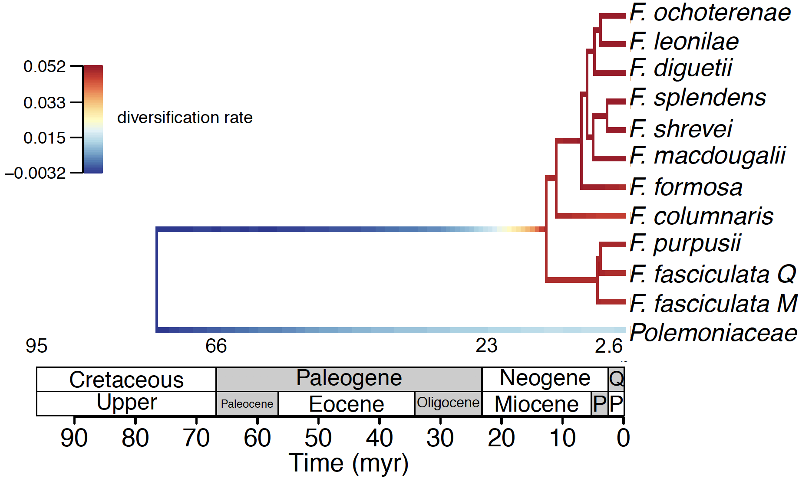
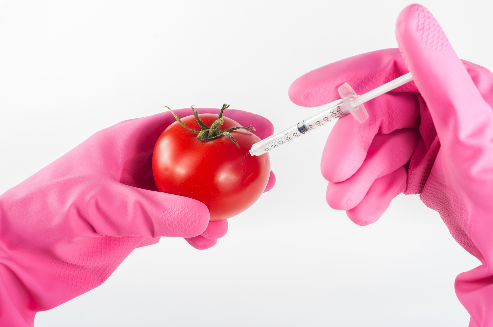
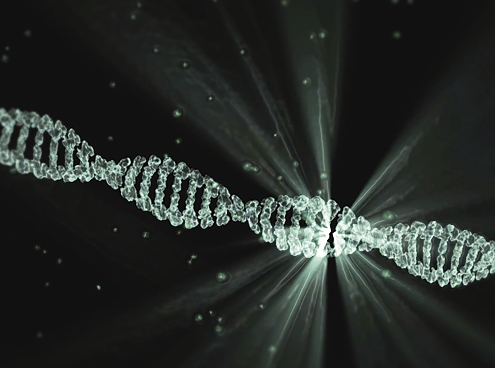
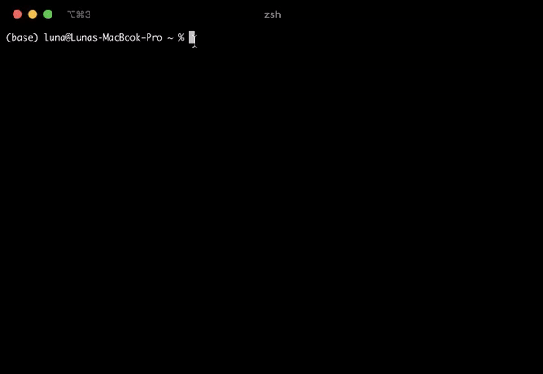

background-image: url("bg/1-blue.png")
background-position: center
background-size: contain

class: left, middle, blue-gray


```{r setup, include=FALSE}
options(htmltools.dir.version = FALSE)
knitr::opts_chunk$set(echo = FALSE)
options(knitr.duplicate.label = 'allow')
```

.font3[**Physcraper**]

.font2[Continual .red[updating] of evolutionary estimates in the Open Tree of Life]

<br/>
### .red[<sup>*</sup>] `r params$authorA` .red[&#183;]  `r params$authorB` .red[&#183;] `r params$authorC`
<br/>
### `r params$institute`
<br/>


`r params$event` .red[&#183;] `r params$date` .red[&#183;] `r params$place`

Slides last updated on  `r format(Sys.Date(), format = "%B %d, %Y")` .red[&#183;] Find the code for them in [`r anicon::faa("github", animate="passing")`  here]()

.red[*] Speaker contact [@LunaSare](https://www.lunasare.com/) on [Github `r anicon::faa("github", animate="float")`](https://github.com/LunaSare) and [Twitter `r anicon::faa("twitter", animate="float")`](https://twitter.com/LunaSare)
---

background-image: url("bg/2-past-future1.png")
background-position: center
background-size: contain

???

# To understand our future you need to understand where you come from.

---
background-image: url("bg/3-diversity1.png")
background-position: center
background-size: contain

???

# As biologists, we want to understand how all living things are connected evolutionarily

---
background-image: url("bg/4-diversity2.png")
background-position: center
background-size: contain

class: split-20, center

.row[.content[
# Let's talk scale... .orange[how many] organisms are there?

]]
.row.split-two[
.column[.content.center[
<br/><br/><br/>
### &emsp; &emsp; &emsp;  Estimates range between
## &emsp; &emsp; &emsp; .orange[3 million] .font_small.gray[(Mayr 2010)]
### &emsp; &emsp; &emsp;  and
## &emsp; &emsp; &emsp; .blue[100 million] .font_small.gray[(Mora et al. 2011)]
### &emsp; &emsp; &emsp; living species
]]

.column[.content.center[
<br/><br/><br/>
### How many more have existed &emsp; &emsp;
### in the past??? &emsp;
<br/>
.font4[`r emo::ji("scream")` &emsp; ]
]]
]

???
# There are a gazillion species living, and many more so extinct
# It is a problem for big data managment and analysis
---
background-image: url("bg/5-tree-of-life-red.png")
background-position: center
background-size: contain

class: split-two

.column.split-20[
.column[.content[
]]
.column.split-20[
.row[.content[
# How can we understand the past?
]]
.row.split-20[
.row[.content[
## *Phylogenetic .red[trees]*
]]
.row.split-two[
.row[.content[
### - A graphical representation of a hypothesis of .red[ancestor-descendant] relationships among living and extinct species
]]
.row[.content[
### - The most important item for the study of biology and all related fields!
]]
]
]
]
]
.column[.content[
<br/><br/><br/><br/><br/><br/><br/><br/><br/><br/><br/>
<br/><br/><br/><br/><br/><br/><br/><br/><br/><br/><br/>
<br/><br/><br/>
<p style="font-size:0.55em">
<a href="https://i.redd.it/2jh0nmkx4hu11.jpg">
&emsp; &emsp; &emsp; &emsp; &emsp; &emsp; https://i.redd.it/2jh0nmkx4hu11.jpg
</a> </p>
]]

???

This is an artistic representation of evolutionary relationships between organisms. Although there is some information in there.
---
background-image: url("bg/6-wild.png")
background-position: center
background-size: contain

## Phylogenies in the .orange[wild]

---
class: split-two

.column[.content.center[
# What .blue[we] see...
<br/><br/>


.font_small.gray[Figure 4c from De Nova et al. 2018]

<br/><br/>
.font2.blue[A pdf file]

]]
.column[.content.center[
# What a .lime[computer] sees...

<p style="font-size:0.70em">
TREE * STATE_6680000 = [&R] ((2:23.9912476,1:23.9912476):67.64363987,(((((((((13:0.4486448057,18:0.4486448057):0.419000619,12:0.8676454246):0.1015486898,11:0.9691941144):0.03970804765,15:1.008901162):0.4621950546,(21:0.5368201226,14:0.5368191226):0.9342770941):1.047882735,((19:0.9651292965,(16:0.9169158264,17:0.9169148264):0.04821447015):1.162235908,20:2.127366205):0.3916137472):3.896603157,(9:3.020538176,10:3.020538176):3.395044933):10.55399955,(((((((((55:0.8502407373,58:0.8502407373):0.3679373142,(53:0.4864845726,56:0.4864845726):0.731693479):0.3563793329,54:1.574557384):0.09035613592,57:1.66491352):1.88446994,(49:0.8161479593,45:0.8161479593):2.733234501):0.4760065168,(46:2.107086476,(47:0.9224473608,48:0.9224473608):1.184639116):1.918302501):1.583903154,((3:1.071332259,28:1.071332259):3.013986475,(23:4.030250514,((((24:0.765467551,22:0.765466551):0.9079596426,25:1.673426194):1.323739158,((4:1.813102509,(6:0.6164327737,(7:0.3945867261,8:0.3945867261):0.2218450476):1.196669735):0.628500496,(26:1.575611873,5:1.575611873):0.8659911318):0.5555633466):0.282086233,27:3.279251584):0.7509989298):0.05506722029):1.523974397):1.046228415,((((78:1.001185246,79:1.001185246):1.6203738,(77:1.912610336,(80:1.126503072,81:1.126503072):0.7861072638):0.7089487102):0.9192230645,(74:1.580125802,((73:0.9320116249,76:0.9320116249):0.4249115549,75:1.35692418):0.2232026218):1.960657309):1.751839439,(51:1.304268197,(52:0.9244796054,50:0.9244796054):0.3797885921):3.988354352):1.362898998):3.327530237,(43:4.486855597,44:4.486855597):5.496195188):6.986530871):1.541020887,(((((42:0.3927064654,40:0.3927064654):1.216825565,29:1.609532031):0.3505658459,((33:0.05906297464,41:0.05906297464):1.012591397,30:1.071654371):0.8884435051):0.8794856624,(31:0.7769783382,(39:0.6041099539,32:0.6041099539):0.1728683843):2.062605201):4.0079666,(((35:3.024986853,38:3.024986853):0.3694745008,(36:0.7769265764,(37:0.60170545,34:0.60170545):0.1752211264):2.617534778):2.437537487,(71:3.496481764,(((69:0.6822085102,68:0.6822085102):0.2919955037,70:0.9742040138):2.491583884,(((64:2.639693826,(60:1.924607493,67:1.924607493):0.7150863324):0.1614034831,((63:1.369885952,66:1.369885952):0.7113535387,(61:0.7383880773,65:0.7383880773):1.342851413):0.7198578182):0.4360311418,((72:1.070412672,59:1.070412672):1.754535535,62:2.824948207):0.4121802435):0.2286584466):0.03069486699):2.335517077):1.015550298):11.6630534):73.12428394);
</p>

.font2.lime[A newick string]

]]

---
background-image: url("bg/7-use2.png")
background-position: center
background-size: contain

# What are .gray[phylogenies useful] for?


???

Conclusion: phylogenies are very important for our survival

---
background-image: url("bg/8-data-sharing.png")
background-position: center
background-size: contain

class: split-10
.column[
]
.column.split-40[
.column[.content.left[
<br/><br/><br/>
# Number of published
# phylogenies is around
# the .red[10K's]
]]
.column[
]
]

???

Graphs of accumulation of phylogenies through time

---

class: split-10 center

.row[.content.vmiddle.center[
# How do we .orange[generate] a phylogeny?
]]

.row.split-five[
.column.split-20[
.row[.content.vmiddle[
(0) Get some money.
]]
.row[.content[


]]
]
.column.split-30[
.row[.content.vmiddle[
(1) Get some raw data: catch some organisms, or get them from a museum; get some characters to analyze, preferably DNA.
]]
.row[.content[


]]
]
.column.split-40[
.row[.content.vmiddle[
(2) Assemble a hypothesis of homology. If you chose molecular characters, align the sequences!

]]
.row[.content[


]]
]
.column.split-30[
.row[.content.vmiddle[
(3) Analyse this hypothesis of homology to create a hypothesis of phylogenetic relationships. There are different philosophies!
]]
.row[.content[


]]

]
.column.split-20[
.row[.content.vmiddle[
(4) Compare and discuss the inferred relationships in the context of previous hypothesis.
]]
.row[.content[


]]
]
]

???

Conclusion: They are hard to make and it is a very artisanal endeavor. So you would think that scientists would make an effort to make them available.


extract their DNA, and sequence it, or skip all that and get the DNA from an online nucleotide data repository. There are a bunch and we will get to that in a minute.

phylogenetic relationships among the organisms you collected.
---
background-image: url("bg/1-gray.png")
background-position: center
background-size: contain

# Can we get an already published phylogeny?
<br/><br/><br/>
## General data repositories: Supplementary Data in Journal

## Figures on paper

## Asking the authors

## Reanalyze raw data

---
background-image: url("bg/11-data-sharing2.png")
background-position: center
background-size: contain

## There might be some *data* sharing issues...

???

Main: Sharing is key for reuse of phylogenies; and reuse is key for advancement of science.

Conclusion: Phylogenies are usually not shared but DNA data is
(Drew et al. 2013).
---
background-image: url("bg/12-molecular.png")
background-position: center
background-size: contain

# Getting the raw data
## *Molecular sequence repositories*
### The International Nucleotide Sequence Database Collaboration (INSDC)

<br/>

### &emsp; &#183; .indigo[GenBank] at the National Center for Biotechnology
### Information (NCBI) - Released .indigo[ 1989]
### https://www.ncbi.nlm.nih.gov/genbank/

<br/>

### &emsp; &#183; DNA DataBank of Japan (.orange[DDBJ]) - Released .orange[1986]
### https://www.ddbj.nig.ac.jp/index-e.html

<br/>

### &emsp; &#183; European Nucleotide Archive (.green[ENA]) - Released .green[1982]
### https://www.ebi.ac.uk/ena


???

More effort is going to share the raw molecular data
https://www.ddbj.nig.ac.jp/stats/release-e.html#total_data
---
background-image: url("bg/13-compare.png")
background-position: center
background-size: contain

## Public molecular data is in the order of .red[trillions]
#### Figure from https://www.ddbj.nig.ac.jp/stats/release-e.html#total_data

---
background-image: url("bg/1-blue.png")
background-position: center
background-size: contain

## Let's zoom in into the GenBank database
#### &emsp; &emsp; &emsp; &emsp; Figure from https://www.nlm.nih.gov/about/2021CJ.html

<a href="https://www.nlm.nih.gov/about/2021CJ.html">

</a>

<a href="https://www.ncbi.nlm.nih.gov/nucleotide/">

</a>

---
background-image: url("bg/1-blue.png")
background-position: center
background-size: contain

class: center

# How do we go about this .blue[massive] amount of raw .red[data]?

---
background-image: url("bg/1-blue.png")
background-position: center
background-size: contain

class: split-70 center

.column.split-20[
.row[.content.vmiddle[
# The dawn of the phylogenetic .blue[pipeline]
]]
.row.split-two[
.column[.content.vmiddle[
Phylota - Sanderson et al. 2008

Amphora - Wu et al. 2008

PHLAWD - Smith et al. 2009

PUmPER - Izquierdo et al. 2014

DarwinTree - Meng et al. 2014

NCBIminer - Xu et al. 2015

SUMAC - Freyman et al. 2015

STBase - McMahon et al. 2015
]]
.column[.content.vmiddle[
BIR - Kumar et al. 2015

SUPERSMART - Antonelli et al. 2017

SOPHI - Chesters et al. 2017

PhyloSkeleton - Guy et al. 2017

OneTwoTree - Drori et al. 2018

PhylotaR - Bennett et al. 2018

pyPHLAWD - Smith et al. 2019

Phylotol - Ceron et al. 2019
]]
]
]
.column.bg-blue[.content.vmiddle[

]]

???
Pipelines for using data from molecular databases

Efforts to make sense of this data: massive data pipelines

https://i.redd.it/hk7eo05svd351.jpg cats
https://i.redd.it/ez4zn3esgyw41.png brains
---
background-image: url("bg/1-red.png")
background-position: center
background-size: contain

class: split-50 center

.column[.content[
# The good

### They have contributed to fill holes on our phylogenetic knowledge of the tree of life and to maybe fix some branches.

### All these efforts contributed to start making the field a little bit more reproducible

]]
.column[.content[
# The bad

### Phylogenetic pipelines are not fully relied by community

### Manual curation always makes for better phylogenies

]]


---
background-image: url("bg/1-blue.png")
background-position: center
background-size: contain

# Phylogenetic data repositories

In parallel, efforts to store actual trees and the alignments that produced them.

TreeBASE and Open Tree of Life

Conclusion: this effort is making the practice of phylogenetics more open.

---
background-image: url("bg/linux-1994.png")
background-position: center
background-size: 300px

# Phylogenetic data repositories
## TreeBASE


https://www.linuxjournal.com/content/party-its-1994
---

<div class="resp-container">
    <iframe class="testiframe" src="https://treebase.org/treebase-web/home.html" width="500px" height="600px">
    </iframe>
</div>

---
exclude: true

background-image: url("bg/treebase1.png")
background-position: center
background-size: contain

---
exclude: true

background-image: url("bg/treebase-search1.png")
background-position: center
background-size: contain

---
exclude: true

background-image: url("bg/treebase-search2.png")
background-position: center
background-size: contain

---
class: split-two

.column[.content[




````
    wget "http://purl.org/phylo/treebase/phylows/
          matrix/TB2:M4382?format=nexus"
````
]]
.column[.content[
]]


---
# Phylogenetic data repositories

## The Open Tree of Life project

### <https://tree.opentreeoflife.org/opentree/argus/opentree12.3@ott93302>

---
background-image: url("https://github.com/OpenTreeOfLife/opentree/raw/master/webapp/static/images/logo.png")
background-position: center
background-size: 500px

class: middle, center

<div class="resp-container">
    <iframe class="testiframe" src="https://tree.opentreeoflife.org/opentree/argus/opentree12.3@ott93302" width="500px" height="600px">
    </iframe>
</div>

---

# Examples of the otol APIs and the type of data structure they return

Conclusion: we need python!

---

# Physcraper

---
class: right, middle, blue-gray


.font3[**Questions?**]

.font2[See you on Thursday .red[July 9], from .red[2:45]pm to .red[3:45]pm (CDT) at SciPy2020's [Biology and Bioinformatics Q&A and Moderated Discussion](https://www.scipy2020.scipy.org/schedule) live session!]

<br/>

.font2[**Tried physcraper and have suggestions?** ]
.center[
<p style="font-size:1.55em"> Contact `r anicon::faa("envelope", animate="pulse")` us at <a href="https://mctavishlab.github.io/contact/"> ejmctavish@ucmerced.edu </a> <br/>
.red[&#183; &#183; &#183;] <br/>
Post an issue on our `r anicon::faa("github", animate="pulse")` Github repo  at <a href="https://github.com/McTavishLab/physcraper/issues">  https://github.com/McTavishLab/physcraper/issues </a> </p>
]
---
class: split-60, blue-gray

.column[.content.vmiddle[

The University of California, Merced cluster, MERCED (Multi-Environment Research Computer for Exploration and Discovery) supported by the National Science Foundation (Grant No. ACI-1429783).

]]

.column[.content.vmiddle[
# Acknowledgements
]]

---
class: split-two, blue-gray


.column[.content.center.vmiddle.font_small[

```{r, load_refs, echo=FALSE}
library(RefManageR)
bib <- ReadBib("./assets/my_bib.bib", check = FALSE)
ui <- "- "
```

```{r, print_refs, results='asis', echo=FALSE, warning=FALSE, message=FALSE}
# writeLines(ui)
print(bib[key = "mayr2010tropical"],
  .opts = list(check.entries = FALSE,
               style = "html",
               bib.style = "authoryear"))
print(bib[key = "mora2011how"],
  .opts = list(check.entries = FALSE,
               style = "html",
               bib.style = "authoryear"))
print(bib[key = "drew2013lost"],
  .opts = list(check.entries = FALSE,
               style = "html",
               bib.style = "authoryear"))
print(bib[key = "magee2014dawn"],
  .opts = list(check.entries = FALSE,
               style = "html",
               bib.style = "authoryear"))
print(bib[key = "stenz2015exploring"],
  .opts = list(check.entries = FALSE,
               style = "html",
               bib.style = "authoryear"))
print(bib[key = "sanmartin2007west"],
  .opts = list(check.entries = FALSE,
               style = "html",
               bib.style = "authoryear"))
print(bib[key = "redelings2017supertree"],
  .opts = list(check.entries = FALSE,
               style = "html",
               bib.style = "authoryear"))
print(bib[key = "magallon2019thirty"],
  .opts = list(check.entries = FALSE,
               style = "html",
               bib.style = "authoryear"))
print(bib[key = "sakamoto2016dinosaurs"],
  .opts = list(check.entries = FALSE,
               style = "html",
               bib.style = "authoryear"))
print(bib[key = "gaunt2001phylogenies"],
  .opts = list(check.entries = FALSE,
               style = "html",
               bib.style = "authoryear"))
print(bib[key = "de2018recent"],
  .opts = list(check.entries = FALSE,
               style = "html",
               bib.style = "authoryear"))
```

]]
.column[.content.vmiddle.center[
# References
]]

???

code from https://github.com/yihui/xaringan/issues/26
