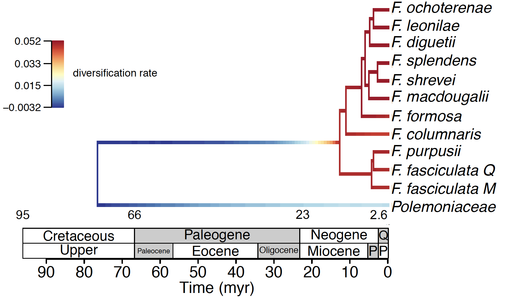
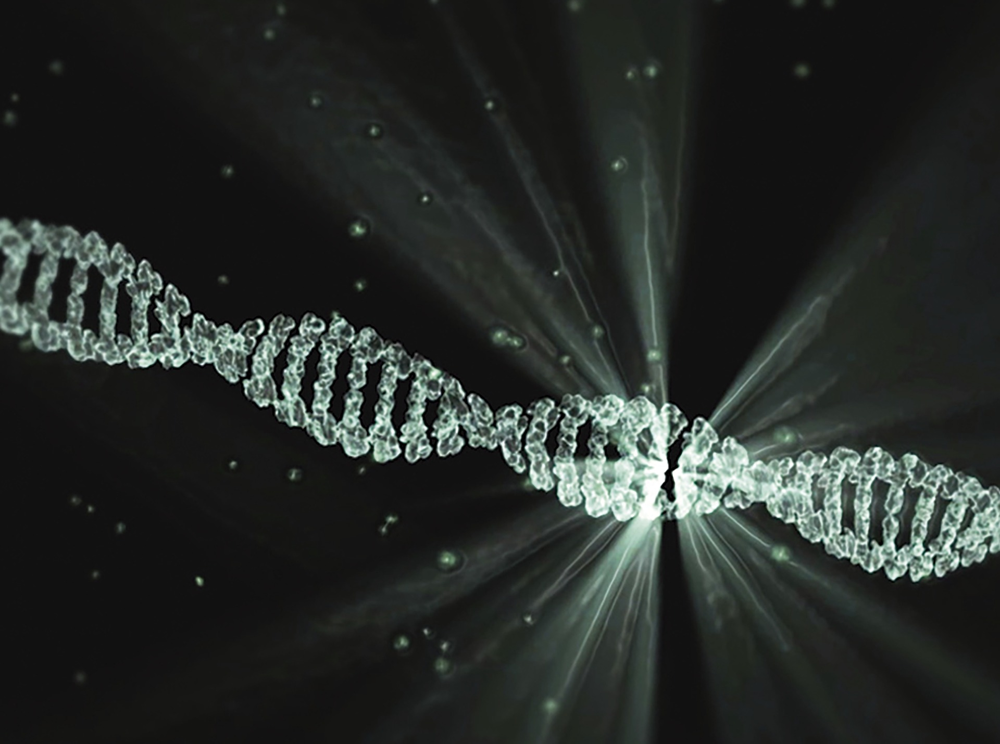

background-image: url("bg/1-gradient1.png")
background-position: center
background-size: contain

class: left, middle, black


```{r setup, include=FALSE}
options(htmltools.dir.version = FALSE)
knitr::opts_chunk$set(echo = FALSE)
options(knitr.duplicate.label = 'allow')
```

.font3[**Physcraper**]

.font2[Continual .red[updating] of evolutionary estimates in the Open Tree of Life]

<br/>
### .red[<sup>*</sup>] `r params$authorA` .red[&#183;]  `r params$authorB` .red[&#183;] `r params$authorC`
<br/>
### `r params$institute`
<br/>


`r params$event` .red[&#183;] `r params$date` .red[&#183;] `r params$place`

Slides last updated on  `r format(Sys.Date(), format = "%B %d, %Y")` .red[&#183;] Find the code for them in [`r anicon::faa("github", animate="passing")`  here]()

.red[*] Speaker contact [@LunaSare](https://www.lunasare.com/) on [Github `r anicon::faa("github", animate="float")`](https://github.com/LunaSare) and [Twitter `r anicon::faa("twitter", animate="float")`](https://twitter.com/LunaSare)
---
background-image: url("bg/1-gradient.png")
background-position: center
background-size: contain

class: center

<br/><br/><br/><br/>
.font3[So, we have a problem ...]


---
background-image: url("bg/1-gradient.png")
background-position: center
background-size: contain

class: center

<br/><br/><br/><br/>
.font3[How can we stay up to date with the .blue[massive] amount of new .orange[data],
while taking advantage of the already existing .gray[knowledge]?]


---
background-image: url("bg/3-diversity1.png")
background-position: center
background-size: contain

???

# As biologists, we want to understand how all living things are connected evolutionarily

---
background-image: url("bg/4-diversity2.png")
background-position: center
background-size: contain

class: split-20, center

.row[.content[
# Let's talk scale... .orange[how many] organisms are there?

]]
.row.split-two[
.column[.content.center[
<br/><br/><br/>
### &emsp; &emsp; &emsp;  Estimates range between
## &emsp; &emsp; &emsp; .orange[3 million] .font_small.gray[(Mayr 2010)]
### &emsp; &emsp; &emsp;  and
## &emsp; &emsp; &emsp; .blue[100 million] .font_small.gray[(Mora et al. 2011)]
### &emsp; &emsp; &emsp; living species
]]

.column[.content.center[
<br/><br/>
### 99.9% of species that have ever &emsp; &emsp;
### existed have gone extinct &emsp; &emsp;
## .font_small.gray[(Mayr 1997)] &emsp; &emsp;
<br/>
### How many more species have  &emsp; &emsp;
### existed in the past??? &emsp;
.font4[`r emo::ji("scream")` &emsp; ]
]]
]

???
# There are a gazillion species living, and many more so extinct
# It is a problem for big data managment and analysis
---
background-image: url("bg/5-tree-of-life-red.png")
background-position: center
background-size: contain

class: split-two

.column.split-20[
.column[.content[
]]
.column.split-20[
.row[.content[
# How can we understand the past?
]]
.row.split-20[
.row[.content[
## *Phylogenetic .red[trees]*
]]
.row.split-two[
.row[.content[
### - A graphical representation of a hypothesis of .red[ancestor-descendant] relationships among living and extinct species
]]
.row[.content[
### - The most important item for the study of biology and all related fields!
]]
]
]
]
]
.column[.content[
<br/><br/><br/><br/><br/><br/><br/><br/><br/><br/><br/>
<br/><br/><br/><br/><br/><br/><br/><br/><br/><br/><br/>
<br/><br/><br/>
<p style="font-size:0.55em">
<a href="https://i.redd.it/2jh0nmkx4hu11.jpg">
&emsp; &emsp; &emsp; &emsp; &emsp; &emsp; https://i.redd.it/2jh0nmkx4hu11.jpg
</a> </p>
]]

???

This is an artistic representation of evolutionary relationships between organisms. Although there is some information in there.
---
background-image: url("bg/6-wild-orange.png")
background-position: center
background-size: contain

# Phylogenies in the .orange[wild]

---
class: split-two

.column[.content.center[
# What .blue[we] see...
<br/><br/>


.font_small.gray[Figure 4c from De Nova et al. 2018]

<br/><br/>
.font2[A .blue[pdf]/.blue[jpg]/.blue[png] file]

]]
.column.bg-black.white[.content.center[
# What a .lime[computer] sees...

<p style="font-size:0.70em">
TREE * STATE_6680000 = [&R] ((2:23.9912476,1:23.9912476):67.64363987,(((((((((13:0.4486448057,18:0.4486448057):0.419000619,12:0.8676454246):0.1015486898,11:0.9691941144):0.03970804765,15:1.008901162):0.4621950546,(21:0.5368201226,14:0.5368191226):0.9342770941):1.047882735,((19:0.9651292965,(16:0.9169158264,17:0.9169148264):0.04821447015):1.162235908,20:2.127366205):0.3916137472):3.896603157,(9:3.020538176,10:3.020538176):3.395044933):10.55399955,(((((((((55:0.8502407373,58:0.8502407373):0.3679373142,(53:0.4864845726,56:0.4864845726):0.731693479):0.3563793329,54:1.574557384):0.09035613592,57:1.66491352):1.88446994,(49:0.8161479593,45:0.8161479593):2.733234501):0.4760065168,(46:2.107086476,(47:0.9224473608,48:0.9224473608):1.184639116):1.918302501):1.583903154,((3:1.071332259,28:1.071332259):3.013986475,(23:4.030250514,((((24:0.765467551,22:0.765466551):0.9079596426,25:1.673426194):1.323739158,((4:1.813102509,(6:0.6164327737,(7:0.3945867261,8:0.3945867261):0.2218450476):1.196669735):0.628500496,(26:1.575611873,5:1.575611873):0.8659911318):0.5555633466):0.282086233,27:3.279251584):0.7509989298):0.05506722029):1.523974397):1.046228415,((((78:1.001185246,79:1.001185246):1.6203738,(77:1.912610336,(80:1.126503072,81:1.126503072):0.7861072638):0.7089487102):0.9192230645,(74:1.580125802,((73:0.9320116249,76:0.9320116249):0.4249115549,75:1.35692418):0.2232026218):1.960657309):1.751839439,(51:1.304268197,(52:0.9244796054,50:0.9244796054):0.3797885921):3.988354352):1.362898998):3.327530237,(43:4.486855597,44:4.486855597):5.496195188):6.986530871):1.541020887,(((((42:0.3927064654,40:0.3927064654):1.216825565,29:1.609532031):0.3505658459,((33:0.05906297464,41:0.05906297464):1.012591397,30:1.071654371):0.8884435051):0.8794856624,(31:0.7769783382,(39:0.6041099539,32:0.6041099539):0.1728683843):2.062605201):4.0079666,(((35:3.024986853,38:3.024986853):0.3694745008,(36:0.7769265764,(37:0.60170545,34:0.60170545):0.1752211264):2.617534778):2.437537487,(71:3.496481764,(((69:0.6822085102,68:0.6822085102):0.2919955037,70:0.9742040138):2.491583884,(((64:2.639693826,(60:1.924607493,67:1.924607493):0.7150863324):0.1614034831,((63:1.369885952,66:1.369885952):0.7113535387,(61:0.7383880773,65:0.7383880773):1.342851413):0.7198578182):0.4360311418,((72:1.070412672,59:1.070412672):1.754535535,62:2.824948207):0.4121802435):0.2286584466):0.03069486699):2.335517077):1.015550298):11.6630534):73.12428394);
</p>

.font2[A .lime[newick] string]

]]

???
Newick string from file Fouquieria_30May17_v1_1000.trees. First tree of the series.
---
background-image: url("bg/7-use2.png")
background-position: center
background-size: contain

# What are .purple[phylogenies useful] for?


???

Conclusion: phylogenies are very important for our survival

---
background-image: url("bg/8-data-sharing.png")
background-position: center
background-size: contain

class: split-10
.column[
]
.column.split-40[
.column[.content.left[
<br/><br/><br/>
# Number of published
# phylogenies is around
# the .red[10K's]
]]
.column[
]
]

???

Graphs of accumulation of phylogenies through time

---

class: split-10 center white

.row.black.bg-gray[.content.vmiddle.left[
# How do we .pink[generate] a phylogeny?
]]
.row.split-five[
.column.bg-gray.split-10[
.row[.content.vmiddle[
(1) Get some money.
]]
.row[.content[


]]
]
.column.bg-white.black.split-30[
.row[.content.vmiddle[
(2) Get some raw data: catch some organisms, or get them from a museum; get some characters to analyze, preferably DNA.
]]
.row[.content[


]]
]
.column.bg-gray.split-40[
.row[.content.vmiddle[
(3) Assemble a hypothesis of homology. If you choose molecular characters, align the sequences!

]]
.row[.content[


]]
]
.column.bg-white.black.split-30[
.row[.content.vmiddle[
(4) Analyse this hypothesis of homology to create a hypothesis of phylogenetic relationships. There are different philosophies!
]]
.row[.content[


]]

]
.column.bg-gray.split-30[
.row[.content.vmiddle[
(5) Compare and discuss the inferred relationships in the context of previous hypothesis.
]]
.row[.content[


]]
]
]

???

Conclusion: They are hard to make and it is a very artisanal endeavor. So you would think that scientists would make an effort to make them available.


extract their DNA, and sequence it, or skip all that and get the DNA from an online nucleotide data repository. There are a bunch and we will get to that in a minute.

phylogenetic relationships among the organisms you collected.
---

class: split-10 center

.row.bg-black.white[.content.vmiddle.left[
# How can we get a .yellow[published] phylogeny?
]]
.row.split-two[
.row.split-four[
.column[.content.vmiddle[
## General data repositories--
## Supplementary Data in Journals
]]
.column[.content[

]]
.column.bg-black.white[.content[


.font_small.gray[Figure 4c from De Nova et al. 2018]

.blue[A pdf/jpg/png file]
]]
.column.bg-black.white[.content.vmiddle[
## Figures on
## published papers
]]
]
.row.split-two[
.column.bg-black.white[.content.vmiddle[
## Asking the authors

]]
.column[.content.vmiddle[
## Reanalyzing the raw data


]]
]
]

---
background-image: url("bg/11-data-sharing-orange.png")
background-position: center
background-size: contain

## There might be some *data* sharing issues...

???

Main: Sharing is key for reuse of phylogenies; and reuse is key for advancement of science.

Conclusion: Phylogenies are usually not shared but DNA data is
(Drew et al. 2013).
---
background-image: url("bg/12-molecular-gray.png")
background-position: center
background-size: contain

# Getting the .gray[**raw data**]
## *Molecular sequence repositories*
### The International Nucleotide Sequence Database Collaboration (INSDC)

<br/>

### &emsp; &#183; .indigo[GenBank] at the National Center for Biotechnology
### Information (NCBI) - Released .indigo[ 1989]
### https://www.ncbi.nlm.nih.gov/genbank/

<br/>

### &emsp; &#183; DNA DataBank of Japan (.amber[DDBJ]) - Released .amber[1986]
### https://www.ddbj.nig.ac.jp/index-e.html

<br/>

### &emsp; &#183; European Nucleotide Archive (.green[ENA]) - Released .green[1982]
### https://www.ebi.ac.uk/ena


???

More effort is going to share the raw molecular data
https://www.ddbj.nig.ac.jp/stats/release-e.html#total_data
---
background-image: url("bg/13-compare-gray.png")
background-position: center
background-size: contain

# Public .gray[**molecular data**] is in the order of .red[**trillions**]
#### Figure from https://www.ddbj.nig.ac.jp/stats/release-e.html#total_data

---
background-image: url("bg/1-gray.png")
background-position: 50% 0%
background-size: 100%

# Let's *zoom in* into the .gray[**GenBank database**]
#### &emsp; &emsp; &emsp; &emsp; Figure from https://www.nlm.nih.gov/about/2021CJ.html

<a href="https://www.nlm.nih.gov/about/2021CJ.html">

</a>

<a href="https://www.ncbi.nlm.nih.gov/nucleotide/">

</a>

---
background-image: url("bg/1-gradient.png")
background-position: center
background-size: contain

class: center

<br/><br/><br/><br/>
.font3[How do we go about
this .blue[massive] amount of raw .orange[data]?]


---
background-image: url("bg/1-gradient.png")
background-position: center
background-size: contain

class: split-70 center

.column.split-20[
.row[.content.vmiddle[
# The dawn of the phylogenetic .blue[pipeline]
]]
.row.split-two[
.column[.content.vmiddle[
Phylota - Sanderson et al. 2008

Amphora - Wu et al. 2008

PHLAWD - Smith et al. 2009

PUmPER - Izquierdo et al. 2014

DarwinTree - Meng et al. 2014

NCBIminer - Xu et al. 2015

SUMAC - Freyman et al. 2015

STBase - McMahon et al. 2015
]]
.column[.content.vmiddle[
BIR - Kumar et al. 2015

SUPERSMART - Antonelli et al. 2017

SOPHI - Chesters et al. 2017

PhyloSkeleton - Guy et al. 2017

OneTwoTree - Drori et al. 2018

PhylotaR - Bennett et al. 2018

pyPHLAWD - Smith et al. 2019

Phylotol - Ceron et al. 2019
]]
]
]
.column.bg-blue[.content.vmiddle[

]]

???
Pipelines for using data from molecular databases

Efforts to make sense of this data: massive data pipelines

https://i.redd.it/hk7eo05svd351.jpg cats
https://i.redd.it/ez4zn3esgyw41.png brains
---
background-image: url("bg/1-gradient.png")
background-position: center
background-size: contain

class: split-20 center

.row[.content.vmiddle[
# The phylogenetic .blue[pipeline]
]]
.row.split-two[
.column.split-10[
.column[
]
.column[.content.vmiddle[
# The good `r emo::ji("+1")`
<br/>
### They have contributed to fill holes on our phylogenetic knowledge on the tree of life and also potentially to "fix" knowledge on some branches.
<br/>
### All these efforts contributed to start making the field a little bit more reproducible
]]
]
.column[.content.vmiddle[
# The bad `r emo::ji("-1")`
<br/>
### Phylogenetic pipelines are not fully relied by community
<br/>
### Manual curation always makes
### for better phylogenies
]]
]
---
background-image: url("bg/1-gray.png")
background-position: center
background-size: contain

class: split-20

.row[.content.vmiddle[
# &emsp; Getting the .gray[**published tree**] (in computer readable format)
## &emsp; &emsp; *Phylogenetic tree data repositories*
]]

.row.split-two[
.row.split-60[
.column[.content.vmiddle[
### &emsp; &emsp; &emsp; &#183; .indigo[TreeBASE] - Released .indigo[1994]
### &emsp; &emsp; https://treebase.org/treebase-web/home.html
### &emsp; &emsp; If the TreeBASE webpage is lagging, go [here]() for a demo.
]]
.column[.content[
<br/><br/><br/><br/><br/><br/><br/><br/>
<p style="font-size:0.75em; position:relative; right:20%; bottom:2%;">
<a href="https://www.linuxjournal.com/content/party-its-1994">
&emsp; &emsp; &emsp; &emsp; &emsp; &emsp; www.linuxjournal.com
</a> </p>
]]
]
.row[.content.vmiddle[
### &emsp; &emsp; &emsp; &#183; The  .orange[Open Tree of Life] project- Released .orange[2010]
### &emsp; &emsp; [https://tree.opentreeoflife.org/opentree12.3@ott93302](https://tree.opentreeoflife.org/opentree/argus/opentree12.3@ott93302)
]]
]

<img src="data:image/jpeg;base64,/9j/4AAQSkZJRgABAQAAAQABAAD/2wCEAAkGBxITEBMSEhEWFRUWGRUbGBcXGRgVFxUYFxcXFxUVFxUYHSggHRslHRUVITEiJSkrLi4uFx8zODMsNygtLisBCgoKDg0OGxAQGy0lHyItLS0wLy0tLS0tLS0tLSstLS01LS0tLS0tLS0tLS0tLS0tLS0tLS0tLS0rKy0tLS0tK//AABEIAOEA4QMBIgACEQEDEQH/xAAcAAEAAwEBAQEBAAAAAAAAAAAABQYHBAEDAgj/xAA8EAABAwIDBQUFBgYCAwAAAAABAAIDBBEFBiESMUFRYQcTIjJxQlJigbEUcpGhweEWIzRUktE1ghUksv/EABoBAQADAQEBAAAAAAAAAAAAAAABAwQCBQb/xAAqEQACAgEEAQQBAwUAAAAAAAAAAQIDEQQSITETIkFCUWEyM3EUIyQ0of/aAAwDAQACEQMRAD8AgERF9CeSEREAREQBERAEREAREQBERAEREAREQBERAEREAREQBERAEREAREQBERAEREAREQBERAEREAREQBERAEREAREQBERAEREAREQBERAEREAREQBERAEREAREQBERAEREAREUEhXnI2TDMRPUNtGPKw+31PReZGyaZiJ5xaMatYfa6notOqqiOGMveQxjBv3AAcFg1Op+MTTVT8pEHjmTqeeItawMcPK4C1isgxTDpKeQxSts4fg4cwtdyxnSCse9jbscD4Q7228COu/RdWacuR1kRaRZ48ruIP8ApU03yre2ZZZUprMTDUXXimHSU8pilFnDdycOYXIvVTTWUYmsBERSQEREAREQBERAEREAREQBERAEREAREQBERAERFACvGRcnGYionaRGPK0+1yJHJMi5NMxE87bRjVrT7XU9Fp1VUxwxl7yGMYNTuAAWDU6n4RNVNPykKmojhiLnuDGMG/cABwWMZwzS+ufsi7adp8Ld23bc53TomcM0vrn2bdtO0+Fvv29pygFOm02PVIi67Ppiexvc1zXscWubq1zdCD0Wv5FzeKtvdSaTtGtho4D2gsnw+hknkEcbbuP5dVs2U8sx0kfAyEeJ36Domt2Jc9k6fdn8H1zTlyOsis4APHldxB/0sXxTDpKeV0UrSHA/Jw4ELeTicPfCDvG94RfYvrZR2acuR1kRa7R48ruIPL0WfT3uviXRZbUpcrswxF1Yph0lPKYpW2cPwI5hcq9ZST6MTWAiIpICIiAIiIAiIgCIiAIiIAiIgCIiAIiIArxkXJxlInqG2jHladNrqeirWX56SOUSVZOy03DA0uuetloUfafh4AA2wOWwdAsepsn+mKNFMIvmTLjU1EcMZe9wYxg1J0ACxjN+aX1z9lt207T4W7ts++7/AEmcM0yVz7C7advlb73xO6dFALjT6bHql2Tddn0oLow+hkmkbHG0lxPDh1K57K8ZWzXhlGy13ukPmdsHfyC03WOC4XJVCKk+S7ZSyzHSR7gZD5nfoFyZ3zcykZ3cZDp3Dwj3fiKh8U7UIDERTBzpDuuLAdVm08rnvMkjtp7tSTr8lhqolZLdM0ztjBYift9VKZe+Mh7299viDe/4dFrWRs4NqmiKWzZ2jUe+B7Q66ahZAvY3ua5r2Etc03aRvBWu7TxnHCKK7nFm5Zpy5HWRWcLPHldxBWL4ph0lPK6KVpDgfk4cCFfsI7T4WxAVQcJBoS0XD/i6LizNm7DKyPZdth48rtg6HgD0WaiVlctrXBdbGE1lMoaIfW/VF6RkCIiEBERAEREAREQBF04bTd7NHF77rab9VPYrk8QyFrq2mYOAkcQ75gBVysjF4bO1GT5wVhFY6HJ7pnbMNbSyOHBriT9F+KvKvdOLJa+kY8b2ucQR+S580Psnxy+ivorNh2THTOtFWU0nMMcSbdBZQWI07Y5XxtNw0kXPMb11GyMnhM5cWuzmREVhyEREJCIigBFZ6HItTK0OY+Igi+/dfmvvN2eVLBd88DR8RIVTurXDaO1XL2RUUVrlyBVgbTXRyDmw3+qrldRSQv2JWFjuR49V1GyEuE0cuLXaOdEX2paV8jgyNhc47gF03jkhI+KKazDlyWkEZkIO2NbcDyUKkZKSyg008MIisuGZLqJI+9eWwx7yZDbTn6KJTjH9TwSot9FaRXCmybDNcU1dFI8bwCoiuy5JDOIJpY4ydQ9xsz8VwroPjJ145L2IZFb4ezmqeA5s0DgdxBJB/JfObIM7DZ9TTtPIuIP0Ueev7Hjn9FURW2Hs9qX+Sop3fdcT+iruL4a+nmdDIQXNtfZ3arqNsZPCZDhJcs5ERFZg4OzCcSNPKJWsDnAHZvwPArjnPePdI/xOcbknXfwCIFzsWdzOtz6Lb2WxgVmgA8J3C3BRmeYmmvmu0HXl0Ut2X/1n/U/RRmd/6+b1/RZoped/wXP9pERhc/cTxzMGsbg6w0DrcDZeVc23I+Qi224uty2jeykMt4SypmETphGTuBF9roFY8WyfTxVLWPnEUbgLXNy88fRWysrhPns4UJSX4KOinM14TDBM2OCTvNoDQHa1J01CT4bT0wb9sfeRwuIG+YDmXDQLryxwmc7GQaKz0mBU9XBJLRPIdF54nXJGl96gKChkmkEUbbvPDTTmSeCRsjLL+g4NHOimp2UEDzHI907x5yy7Qw8RfiujF8utbTMrKaTvIH24EFt+ahWxbx9k+NpEv2SuInkG04gjcTcfJd/bG28dNqR43bjbhxUf2Uf1D/RWftDwJ1U2ENkYzZcT4yBe44XWKW1ajk0Ry6uCpdl2ISR1Jh2nOjePK4k7LuYJ+itfadQsfSF5sHNIs7j6L45Kyl9mLpzI2V9rANIsPmqv2gY7UzO7mSB0MTTfXXbcNxDuScSvzAdV+oqAWgdltCAZKp5AaLNaToAb2OqoAaToN50HqVdM2y/ZqGlpWmziWySAf5fVatRlrYu2U1YT3P2Ld2jYb31GXAax+IWWOBbzhNQKqjY46h7NViOL0ZhnliO9rj+BOip0cu4Ms1C6kSuRKBs1dG14BaASR1GoV27VoZDSM7u4YHfzAPdss4wLFDS1DJwL7OhHwnzH8FuFDWwVcIcwtkY8aj14ELnUtxsUn0TSk4OK7MBpHuie2SI7D2m4I0v623qw5zxyKs7h7blzWkSAi1j0VszH2dNdtSUx2Xb9g7j0HJZtVUz43lkjS1zd4Kvg67ZKS7RVJTgsM1rssv8A+Pbck+J+/wBVSu1GO9eNXeQbiRxV17LP+Pb99/1UZnbKclRVd42VjRs2s4gHf1WSDjG97ui+SbrWDO8Jq308zJmOf4CCRtGxHEEKRzdicdTVumiN2uay99PEBqrTFlb7LQVL5HMe8jS1iG/MLO2bgttbjOW6PtwZ57oxwz9IiK8q4CBEUklw7L/6z/qfoozO/wDXzev6KX7K4HGqLw07IGp4KLz7C5tdKXNIDjcHmsaf+Q/4L2v7SObKI/8Aep/vhSvai0Gu11GyFGZOYTXQWBNnC9uAUt2oMIrbkGxaLHgVMv8AYRCz4uDh7O8NY+tj00b4rb76afmujMuPWrJg6jhcQ613A3PK6j8nYoKesje82jJs48r6D87Kz5+ys90n2qnb3jX+YN1N+BC4ntV2JdY4JjnZmJCYfnaSBrhDSQs2t5AIv6qa7P4/5VXVlodIQbDgL7wOiqNJglQ8n+U5jW6uc7RrQOJVp7NcRjbJNSyPFpB4Pddzt6pbCMYvaTXJuXJXBmBv9jB+BXVVZzlfTmmbTxRxkWs0HQdOq9zNlOenmdsRufETdpbrYcio3/w8ojdLI3u2DcX6bZ5NCsjCuSTz/wBOZOayi0dk/wDUP9F39ssQcymuL+N3/wArm7KaSQSyPLCG23kWHyUz2p4ZJLDE6Nhd3biSBqdRZZpNf1GWXJPxYKFkzFZaepjDHnu3GzmX0tzHVbBmDDY6ime17QbtJHMG1wQsoyjl6eWpYTG5rGm7nOFh6DqtPzTjDKencL3kc2zGDVxJ0GnJRqdqsWwU52PcZbk7CO9rmxm5bGSSeWydLqwZkzBhklS8TQyPey7CW2t4eS7clYVLBSVFQ+MiWUOIb7Q0/VZrOx+0TI0tedSDvuVcl5p99Fb9EOuzY8jY3SzRuipmuYGey7fbmOiqPaphmxO2cbnjX1GgXD2cSSMrQWscWvGy4gXA46rQ89YSaike1ou5viA4kt1sPVUcU3d8Fn7lfRi7KZ5a54adltrngLr6YZiM1M7bp5CzW5b7DvvK6dnVIXNqqadpbtgWDtD1t6Ks47lyelkLXMJb7LwLgjhuWzyQnJwZn2ySUkadkjNwrWlj2hkzPMODh7zeihO1fDm7Mc4FnDQnmDuuo/svwqUVLp3NLWBhbc6X13ar6dpWMieRtNB/M2NX7OtjwCyRgoX4i+DQ5OVfPZYey3/j2/ff9VS+0+/28eIjwDieavXZtSvjoWtkaWkucbHfYm4VY7TMEndVNljic9pbbw62N0rcXe8iafiWCs4Tj5hp5qd4e9so0N9GH/ShmhSdNl+re4NbTv14kWAvzVizjhrKOjp6ewMjyS53HRbN0ISxH3M7UpLL9iloiK/kqygvWOIII3jUcfyXiKSSVjzRXt8s7G/djA/HVfiozHWyAiSZjgd94xf5FRqKrwwzk63y6Oyhxipgv3EjWX3ksDj8jwX1qMxVsgtJMx43axi/yKjkUuqLefcb3jB4QNylsMzPW042YZ/B7rxt/gVFIplXGSwyIycXlEjieYKuoFpphs+6wbF/vEbwo624glpG4jQj0K8ul1ChGKwg5NvLJ2mzriLG7Ama4WsNpgJHqeKjK7Ep5nB80m2RuAFmD/ouZFCpgnnBPkk+ya/jDEbbIqGNA3bMYH466r9R52xMC32lh9Y7/qoNFHgg/YlWSXuTE2bsRcLGoaByazZ+hUdDXTNk71spMnvP8YHoCue45r0FSqYL2I8kn7kv/F2I/wB0P8P3UfW1ssz9uZwc+1rgbOnovgimNcIvgiU21yd1BjdVAC2CUMB1Phub+q6f4uxL+6H+H7qHulxzUOmD5aJVklxk7Z8ZqnvbI6bxt8paNn8eak4c74gBZ0kcg4AxjT81AIodEH2iVZIl8QzVXTNLHThrD7Mbdg/iFH0NfNASYXhpO8ubtkr4IulVFLCRDnJkv/FuI/3Q/wAP3Xv8XYj/AHQ/w/dQ6LnwV/RPll9kwM3Yj/dD5M/dcFfiU87g6eTvCNxta3yXMimNMIvKRDsk1hsIiK7LOMIIiKAEREAREQBERASeX66nilAqog+J2hdxZ8XotWp8o4e9oeyJrmkXBG4g8Viys2Sc2uo3iOQl1O75mIniOnNY9TXJ+qLNFU49SOrO2TzTkzQgmE7x7n7Knr+h2PjljBBD2PGh3ggrKc8ZPNMTNC0mEnUDXY/Zc6bUZ9EuybqceqJTSVd8kZMM5E84tH7Lfe6novci5OMxE84IjFtlp9rr6LT6qojgjL3uDGMHGwA5BRqdTj0wJpp95FfrMqYdEx0kkTWtaLknRZTjdbDLKTTwiOMaN5u6lSGcM0vrZNlt2wNPhbu2re0f9dFX13pqppbpM4unHqIXRh9E+aRscbbud+XUph9E+aQRxtLnHlw6notlylliOkj3AyuttO/QLu+9Vr8nNVTmzhwbINNHEBMwSP4nl0Chc5wYdRs2WwNdM7yt5fEVYM65uZSM2GHamcPC0a7PV3JY7UTvke6SRxc9xuSfoFmojZY9zfBfbKMFhI/BPy9ERF6JkCIikgIiIAiIgCIiAIiIAiIgCIiAIiIAvCF6iAs2Ss3OoniOQl1O4+piJ4jp0WwscyWMEEPY4eoIX88WVlyTm51G8RyEup3fMxHmPh6LBqdPn1RNVVvxkbHPKyKMuPhYwXPIALF835rfWvs27YB5W+/8RWzh0c0d9HsePUEFZRnfJ5pyZoWkxE6gb2X/AEWfS7N/q7Lb923jop66MPopJpGxxt2nONvTmSvKCikmkbHE3ac7d/srZ8pZYjpI+DpD5nfoOi3X3qtfky11ObGUcsMpI+ch8zv0C586ZtZSM2G+KZ3lby+IrzOubWUbNhlnTOHhby+I9Fj1RO+R7pJHbT3G5J+g6LHTTK2W+ZpssUFtieTzvke6SRxc928n6DovwiL1EklhGJvIREUkBERAEREAREQBERAEREAREQBERAEREAREQBERAWXJWbnUTu7ku6ncfUxE7yPh4lbEx0csdwQ9jx6ggr+eCrLkvNz6NwjkJdTuPqYyeI6dFg1Omz6omqq74yNSwTLkFM57om2Lze/Ich0UbnXNrKOPYZ4pnDwt5fEVwY92iU7Ij9nPeSO8o4DqVllRO+R7pJHFz3HUn6DkqaaJWPdMsstUViJ7UTvke6SRxc928n6L5oi9RJJYRibz2ERFJAREQBERAEREAREQBERAEREAREQBERAEREAREQBERAEREB41oG4WXqIhIREQgIiIAiIgCIiAIiIAiIgCIiAIiIAiIgCIiAIiIAiIgCIiAIiIAiIgCIiAIiIAiIgCIiAIiIAiIgCIiAIiIAiIgCIiAIiIAiIgCIiAIiIAiIgCIiAIiIAiIgCIiAIiIAiIgCIiA//Z"
style="position:fixed; right:3%; top:30%; border:none;"
width="15%" alt="treebase logo"/>


???

# Phylogenetic data repositories

Efforts to store actual trees and the alignments that produced them.
These efforts happened in parallel to the development of pipelines.

TreeBASE and Open Tree of Life

Conclusion: this effort is making the practice of phylogenetics more open.

https://www.linuxjournal.com/content/party-its-1994
---
exclude: true

background-image: url("bg/treebase1.png")
background-position: center
background-size: contain

---
exclude: true

background-image: url("bg/treebase-search1.png")
background-position: center
background-size: contain

---
exclude: true

background-image: url("bg/treebase-search2.png")
background-position: center
background-size: contain

---
class: split-two

.column.split-30[
.row[.content[
# The .indigo[TreeBASE] repository
]]
.row[.content[
````
    wget "http://purl.org/phylo/treebase/phylows/
          tree/TB2:Tr109483?format=nexus"
````
]]
]
.column[.content[

]]
---
class: split-two

.column.split-30[
.row[.content[
# The .orange[Open Tree of Life] API
]]
.row[.content[

````
    curl https://api.opentreeoflife.org/v3/study/
         pg_1144/tree/tree2324
````
]]
]
.column[.content[

]]

???

Conclusion: we need python!
---
background-image: url("bg/1-dusk.png")
background-position: center
background-size: contain

class: center

<br/><br/><br/><br/>
.font3[How do we take .blue[advantage] of
the .orange[published] phylogenies and the raw .red[data]?]

---
background-image: url("bg/1-dusk.png")
background-position: center
background-size: contain

class: split-60

.column[.content.center[
<br/><br/><br/><br/><br/><br/><br/>
.font4[&emsp; &emsp; Physcraper!]
]]
.column[.content.center[

]]

---
background-image: url("bg/1-dusk.png")
background-position: center
background-size: contain
class: split-70

.column.split-10[
.column[
]
.column.split-60[.content[
.column[.content[

**A python toolkit that runs in a .red[virtual environment] or .red[conda]**

```
virtualenv -p python3 venv-physcraper
source venv-physcraper/bin/activate
```

<br/>

**Can be run as a .blue[command line] application**

```
physcraper_run.py --help
usage: physcraper_run.py [-h] [-s STUDY_ID] [-t TREE_ID] [-tl TREE_LINK]
                         [-a ALIGNMENT] [-as ALN_SCHEMA] [-db BLAST_DB]
                         [-o OUTPUT] [-bs BOOTSTRAP_REPS] [-tx TAXONOMY]
                         [-c CONFIGFILE] [-e EMAIL] [-re RELOAD_FILES] [-r]
                         [-tag TAG] [-tb] [-no_est] [-ev EVAL]
                         [-hl HITLIST_LEN] [-tp TRIM_PERC]
                         [-rl RELATIVE_LENGTH] [-spn SPECIES_NUMBER]
                         [-nt NUM_THREADS] [-de DELAY] [-st SEARCH_TAXON]
```

<br/>

**Or using a .orange[jupyter notebook]. Instructions to create your own opentree kernel here:
http://opentreeoflife.github.io/jupyter-venv**

]]
]]
]
.column[.content.center[
# Physcraper!

]]

---

Integrates the Open Tree of Life API responses with:

NCBI (molecular databases)

treebase and supertreebase (other tree and algnment repositories)

Basic software needed for phylogenetics analysis

Uses other tools from the

---
class: right, middle, blue-gray


.font3[**Questions?**]

.font2[See you on Thursday .red[July 9], from .red[2:45]pm to .red[3:45]pm (CDT) at SciPy2020's [Biology and Bioinformatics Q&A and Moderated Discussion](https://www.scipy2020.scipy.org/schedule) live session!]

<br/>

.font2[**Tried physcraper and have suggestions?** ]
.center[
<p style="font-size:1.55em"> Contact `r anicon::faa("envelope", animate="pulse")` us at <a href="https://mctavishlab.github.io/contact/"> ejmctavish@ucmerced.edu </a> <br/>
.red[&#183; &#183; &#183;] <br/>
Post an issue on our `r anicon::faa("github", animate="pulse")` Github repo  at <a href="https://github.com/McTavishLab/physcraper/issues">  https://github.com/McTavishLab/physcraper/issues </a> </p>
]
---
class: split-two, blue-gray

.column[.content.vmiddle[

]]

.column[.content.vmiddle[
# Acknowledgements
<br/><br/>
The University of California, Merced cluster, [MERCED (Multi-Environment Research Computer for Exploration and Discovery)](https://research.ucmerced.edu/node/721) supported by the National Science Foundation (Grant No. ACI-1429783).

]]
---
class: split-two, blue-gray

.column[.content.vmiddle[

]]

.column[.content.vmiddle.font_small[
# Image attributions
<br/>

Dusk Image by <a href="https://pixabay.com/es/users/RitaE-19628/?utm_source=link-attribution&amp;utm_medium=referral&amp;utm_campaign=image&amp;utm_content=3104413">RitaE</a> on <a href="https://pixabay.com/es/?utm_source=link-attribution&amp;utm_medium=referral&amp;utm_campaign=image&amp;utm_content=3104413">Pixabay</a>

Image by <a href="https://pixabay.com/photos/?utm_source=link-attribution&amp;utm_medium=referral&amp;utm_campaign=image&amp;utm_content=1023340">Free-Photos</a> from <a href="https://pixabay.com/?utm_source=link-attribution&amp;utm_medium=referral&amp;utm_campaign=image&amp;utm_content=1023340">Pixabay</a>

Image by <a href="https://pixabay.com/users/12019-12019/?utm_source=link-attribution&amp;utm_medium=referral&amp;utm_campaign=image&amp;utm_content=2361247">David Mark</a> from <a href="https://pixabay.com/?utm_source=link-attribution&amp;utm_medium=referral&amp;utm_campaign=image&amp;utm_content=2361247">Pixabay</a>

Image by <a href="https://pixabay.com/users/272447-272447/?utm_source=link-attribution&amp;utm_medium=referral&amp;utm_campaign=image&amp;utm_content=3848290">272447</a> from <a href="https://pixabay.com/?utm_source=link-attribution&amp;utm_medium=referral&amp;utm_campaign=image&amp;utm_content=3848290">Pixabay</a>

Image by <a href="https://pixabay.com/users/WikiImages-1897/?utm_source=link-attribution&amp;utm_medium=referral&amp;utm_campaign=image&amp;utm_content=62993">WikiImages</a> from <a href="https://pixabay.com/?utm_source=link-attribution&amp;utm_medium=referral&amp;utm_campaign=image&amp;utm_content=62993">Pixabay</a>

Image by <a href="https://pixabay.com/users/MarcelloRabozzi-2003568/?utm_source=link-attribution&amp;utm_medium=referral&amp;utm_campaign=image&amp;utm_content=1446738">Marcello Rabozzi</a> from <a href="https://pixabay.com/?utm_source=link-attribution&amp;utm_medium=referral&amp;utm_campaign=image&amp;utm_content=1446738">Pixabay</a>

Image by <a href="https://pixabay.com/photos/?utm_source=link-attribution&amp;utm_medium=referral&amp;utm_campaign=image&amp;utm_content=1030885">Free-Photos</a> from <a href="https://pixabay.com/?utm_source=link-attribution&amp;utm_medium=referral&amp;utm_campaign=image&amp;utm_content=1030885">Pixabay</a>

Image by <a href="https://pixabay.com/users/steinchen-21981/?utm_source=link-attribution&amp;utm_medium=referral&amp;utm_campaign=image&amp;utm_content=243890">Gaby Stein</a> from <a href="https://pixabay.com/?utm_source=link-attribution&amp;utm_medium=referral&amp;utm_campaign=image&amp;utm_content=243890">Pixabay</a>

Perfect Magnolia Image by <a href="https://pixabay.com/users/kalasoft-11695/?utm_source=link-attribution&amp;utm_medium=referral&amp;utm_campaign=image&amp;utm_content=1455709">Ed Hathaway</a> from <a href="https://pixabay.com/?utm_source=link-attribution&amp;utm_medium=referral&amp;utm_campaign=image&amp;utm_content=1455709">Pixabay</a>

Cerura vinula moth face Image by <a href="https://pixabay.com/users/DreamyArt-512893/?utm_source=link-attribution&amp;utm_medium=referral&amp;utm_campaign=image&amp;utm_content=814568">Selling of my photos with StockAgencies is not permitted</a> from <a href="https://pixabay.com/?utm_source=link-attribution&amp;utm_medium=referral&amp;utm_campaign=image&amp;utm_content=814568">Pixabay</a>

Barn owl Image by <a href="https://pixabay.com/users/dannymoore1973-1813225/?utm_source=link-attribution&amp;utm_medium=referral&amp;utm_campaign=image&amp;utm_content=1107397">danny moore</a> from <a href="https://pixabay.com/?utm_source=link-attribution&amp;utm_medium=referral&amp;utm_campaign=image&amp;utm_content=1107397">Pixabay</a>

Dwarf flying squirrel image from https://critter.science/the-adorable-japanese-dwarf-flying-squirrel/

Treefrog Image by <a href="https://pixabay.com/users/41330-41330/?utm_source=link-attribution&amp;utm_medium=referral&amp;utm_campaign=image&amp;utm_content=765123">41330</a> from <a href="https://pixabay.com/?utm_source=link-attribution&amp;utm_medium=referral&amp;utm_campaign=image&amp;utm_content=765123">Pixabay</a>

Allosaurus Image by <a href="https://pixabay.com/users/WikiImages-1897/?utm_source=link-attribution&amp;utm_medium=referral&amp;utm_campaign=image&amp;utm_content=60588">WikiImages</a> from <a href="https://pixabay.com/?utm_source=link-attribution&amp;utm_medium=referral&amp;utm_campaign=image&amp;utm_content=60588">Pixabay</a>

Mammoth wooly Image by <a href="https://pixabay.com/users/tony241969-5126938/?utm_source=link-attribution&amp;utm_medium=referral&amp;utm_campaign=image&amp;utm_content=2722882">tony241969</a> from <a href="https://pixabay.com/?utm_source=link-attribution&amp;utm_medium=referral&amp;utm_campaign=image&amp;utm_content=2722882">Pixabay</a>

Anomalocaris Image by <a href="https://pixabay.com/users/Goodfreephotos_com-10388/?utm_source=link-attribution&amp;utm_medium=referral&amp;utm_campaign=image&amp;utm_content=347259">Yinan Chen</a> from <a href="https://pixabay.com/?utm_source=link-attribution&amp;utm_medium=referral&amp;utm_campaign=image&amp;utm_content=347259">Pixabay</a>

Dodo Skull By FunkMonk (Michael B. H.) - Own work, CC BY-SA 3.0, https://commons.wikimedia.org/w/index.php?curid=19794759

Rhynia stem By Plantsurfer - Own work, CC BY-SA 2.0 uk, https://commons.wikimedia.org/w/index.php?curid=3823922
]]

---
class: split-10, blue-gray

.column[

]
.column.split-two[
.column[.content.vmiddle.font_small[

```{r, load_refs, echo=FALSE}
library(RefManageR)
bib <- ReadBib("./assets/my_bib.bib", check = FALSE)
ui <- "- "
```

```{r, print_refs, results='asis', echo=FALSE, warning=FALSE, message=FALSE}
# writeLines(ui)
print(bib[key = "mayr1997biology"],
  .opts = list(check.entries = FALSE,
               style = "html",
               bib.style = "authoryear"))
print(bib[key = "mayr2010tropical"],
  .opts = list(check.entries = FALSE,
               style = "html",
               bib.style = "authoryear"))
print(bib[key = "mora2011how"],
  .opts = list(check.entries = FALSE,
               style = "html",
               bib.style = "authoryear"))
print(bib[key = "drew2013lost"],
  .opts = list(check.entries = FALSE,
               style = "html",
               bib.style = "authoryear"))
print(bib[key = "magee2014dawn"],
  .opts = list(check.entries = FALSE,
               style = "html",
               bib.style = "authoryear"))
print(bib[key = "stenz2015exploring"],
  .opts = list(check.entries = FALSE,
               style = "html",
               bib.style = "authoryear"))
print(bib[key = "sanmartin2007west"],
  .opts = list(check.entries = FALSE,
               style = "html",
               bib.style = "authoryear"))
print(bib[key = "redelings2017supertree"],
  .opts = list(check.entries = FALSE,
               style = "html",
               bib.style = "authoryear"))
print(bib[key = "magallon2019thirty"],
  .opts = list(check.entries = FALSE,
               style = "html",
               bib.style = "authoryear"))
print(bib[key = "sakamoto2016dinosaurs"],
  .opts = list(check.entries = FALSE,
               style = "html",
               bib.style = "authoryear"))
print(bib[key = "gaunt2001phylogenies"],
  .opts = list(check.entries = FALSE,
               style = "html",
               bib.style = "authoryear"))
print(bib[key = "de2018recent"],
  .opts = list(check.entries = FALSE,
               style = "html",
               bib.style = "authoryear"))
```

]]
.column[.content.vmiddle[
# References
]]
]

???

code from https://github.com/yihui/xaringan/issues/26
