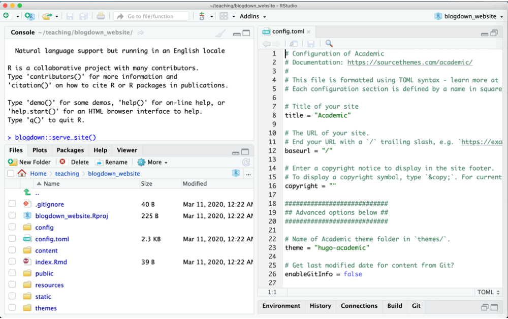
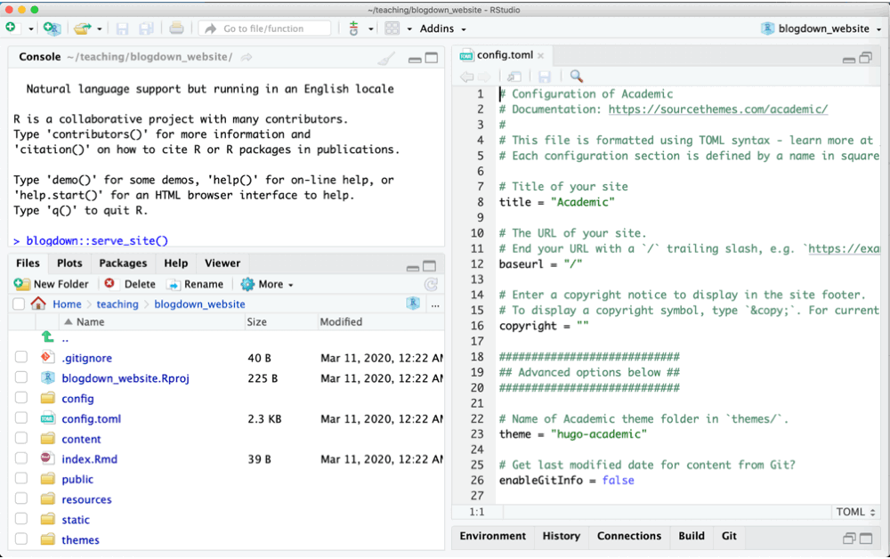
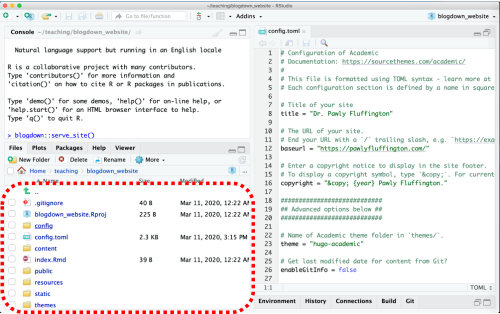
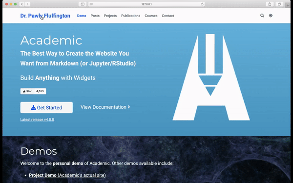
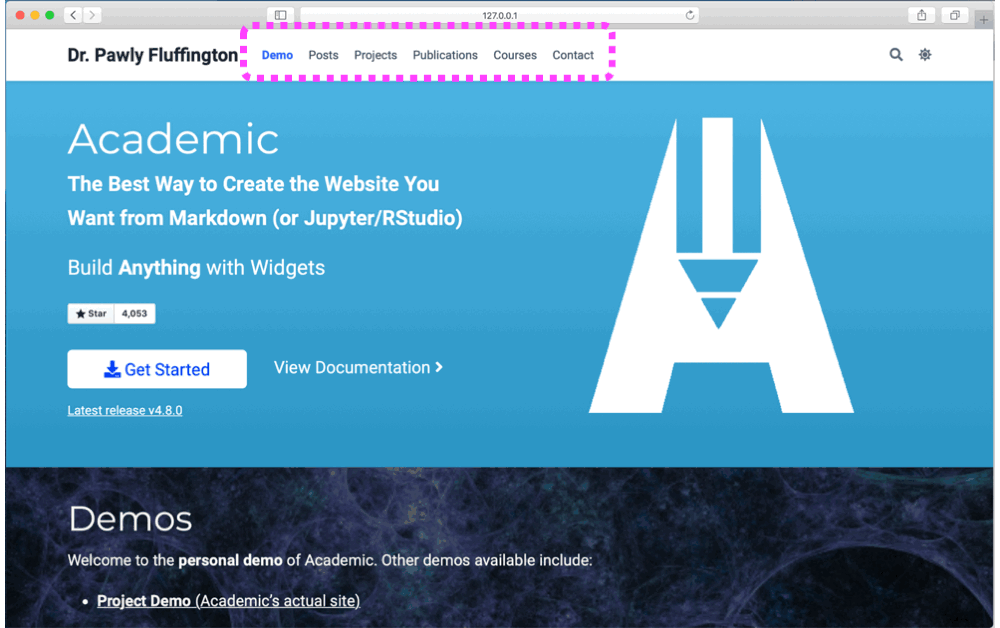
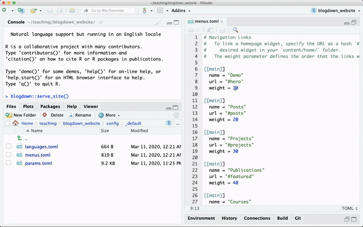
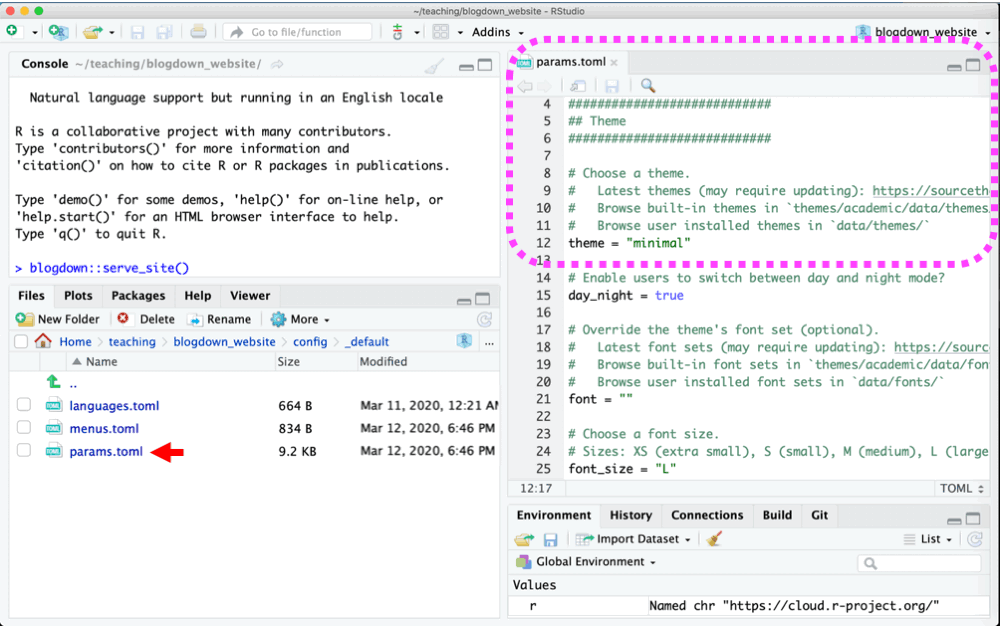
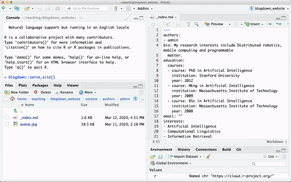

```{r xaringan-themer, include = FALSE}
library(xaringanthemer)
library(emo)
extra_css <- list(
  ".transp"   = list(color = "#fcfcfc00"),
  ".red"   = list(color = gplots::col2hex("red")),
  ".black"   = list(color = gplots::col2hex("black")),
  ".smaller90" = list("font-size" = "90%"),
  ".smaller75" = list("font-size" = "75%"),
  ".larger110" = list("font-size" = "110%"),
  ".larger150" = list("font-size" = "150%")
)
mono_accent(
  base_color = gplots::col2hex("steelblue"),
  title_slide_text_color = gplots::col2hex("steelblue"),
  header_font_google = google_font("Josefin Sans"),
  text_font_google   = google_font("Montserrat", "500", "500i"),
  code_font_google   = google_font("Droid Mono"),
  extra_css = extra_css
)

```
```{r setup, include=FALSE}
options(htmltools.dir.version = FALSE)
knitr::opts_chunk$set(echo = FALSE)
options(knitr.duplicate.label = 'allow')
```
class: inverse, center, middle

#Create a Website Using R!

<br/>

##An Introduction to `blogdown`

<br/><br/><br/><br/>

####Luna L. Sánchez Reyes

####University of California, Merced

<br/><br/><br/><br/>

.pull-left[`r params$event`]

.pull-right[`r params$date` &#183; `r params$place`]


---
class: left, middle

.content.center[#Let's install `blogdown`]

<br/><br/>

--

`r emo::ji("arrow_down")` You can install any package in R with the function `install.packages()`

<br/><br/>


--

`r emo::ji("pencil2")` Open R and just do `install.packages("blogdown")`

---
class: left, middle

.center[
Start a new website project from RStudio by going to the `"File"` menu. 

Name it something you'll remember later.

<br/>


<br/>
]


`r emo::ji("exclamation_mark")` Make sure to enter **gcushen/hugo-academic** as the Hugo theme and keep all other options ticked.

--

`r emo::ji("100")`  This will download all the necessary files to create the backbone of your website.

<!-- <blockquote class="twitter-tweet"><p lang="en" dir="ltr">Then build the template site using this command: <br><br>blogdown::serve_site()<br><br>The viewer window will render a mobile version of your site, but you can also see a desktop version in your browser. <a href="https://t.co/gmVTEDJmpK">pic.twitter.com/gmVTEDJmpK</a></p>&mdash; Dan Quintana (@dsquintana) <a href="https://twitter.com/dsquintana/status/1139846693082419202?ref_src=twsrc%5Etfw">June 15, 2019</a></blockquote> <script async src="https://platform.twitter.com/widgets.js" charset="utf-8"></script> -->

---
class: left, middle

.center[Create the backbone of your website using the `"hugo"` framework.]

<br/><br/>

--

`r emo::ji("sparkles")` Load blogdown using the command `library(blogdown)` 

<br/>

--

`r emo::ji("bone")` Install the "hugo" framework with `blogdown::install_hugo(force = TRUE)`

---
class: left, middle

.center[Build the template of the website with `serve_site()`.


]

`r emo::ji("bowl")` Run the command `blogdown::serve_site()`.

--

`r emo::ji("calling")` This will render a mobile version of your site on the RStudio `viewer window`.

--

`r emo::ji("computer")` It will also generate a `server address` that you can copy-paste unto any web browser to see a local desktop version of your site.

--

`r emo::ji("eyes")` Run `serve_site()` every time you want to check what your website will look like when you modify something.

---
class: left,  middle

.center[Let's actually start our website!



<br/>

]

--

`r emo::ji("pencil2")` Do this by editing the files that are already in your project.

--

`r emo::ji("point_up")` Open any file by selecting it from RStudio's `file browser`.

---
class: left,  middle

.center[Let's start with the `config.toml` file.]

.pull-left[]

.pull-right[]

<br/><br/><br/><br/><br/><br/><br/><br/><br/><br/><br/><br/><br/><br/>

--

With this file you can:

`r emo::ji("triangular_flag")` Change the `title` of your website.

--

`r emo::ji("link")` Add the `URL` of your site once you have one.

--

`r emo::ji("copyright")` Add a `copyright`. Just follow the instructions on the file.

--

`r emo::ji("exclamation_mark")` Do not worry about the `Advanced settings` for now.

---
class: left,  middle

.center[The settings of your website are controlled in files within the `config/_default` folder



]

--

These files will allow you to:

`r emo::ji("speech_balloon")` Configure the site in various `languages` (Example website code [here]())

--

`r emo::ji("hamburger")` Control all the aspects of the `menu`.
<!-- the elements of te menu and their order within the menu, as well as the menu's general position in the site. -->

--

`r emo::ji("art")` Set the color and font `theme` of the site in any way you want!

--

`r emo::ji("mailbox_with_mail")` Modify your `contact` information.

---
class: left,  middle

.center[Let's modify the `menu` of your site.

<br/>



<br/>

]

`r emo::ji("sailboat")` Each element of the menu is a link that allows the users to easily navigate across the content of your site.

---
class: left,  middle

.center[Modify the menu's overall position]

<br/>

.pull-left[]

.pull-right[]

<br/><br/><br/><br/><br/><br/><br/><br/><br/><br/><br/><br/><br/><br/>

`r emo::ji("point_down")` Go to the "Advanced" section of the `params.toml` file.

`r emo::ji("repeat")` Change the `align` parameter.

---
class: left,  middle

.center[Modify the order of the menu's elements]

<br/>

.pull-left[]

.pull-right[]

<br/><br/><br/><br/><br/><br/><br/><br/><br/><br/><br/><br/><br/><br/>

--

`r emo::ji("point_right")` Go to the `menus.toml` file. Each section starting with "[[main]]" defines settings of a menu element.

--

`r emo::ji("weight_lifting_man")` Change the `weight` parameter to modify the position of each element relative to other elements.

---
class: left,  middle

.center[Now modify the menu's content, also in the `menus.toml` file.]

<br/>

.pull-left[]

.pull-right[]

<br/><br/><br/><br/><br/><br/><br/><br/><br/><br/><br/><br/><br/><br/>

--

.transp["]`r emo::ji("hash")`  Do this by `commenting out` the elements you do not want to include in the menu.

--

`r emo::ji("pushpin")`Comment out by placing a `hashtag` symbol at the beginning of a line.

--

`r emo::ji("cupcake")` Extra: Change the `name` argument and see what happens.

---
class: left,  middle

.center[Modify your contact information]
<br/>

.pull-left[]

.pull-right[]

<br/><br/><br/><br/><br/><br/><br/><br/><br/><br/><br/><br/><br/><br/>

Go to the "Contact details" section of `params.toml`

And simply modify as needed.

---
class: left,  middle

.center[Play with the color and font theme of the site in any way you want!]

.pull-left[]

.pull-right[]

<br/><br/><br/><br/><br/><br/><br/><br/><br/><br/><br/><br/><br/><br/>

Go to the "Theme" section of `params.toml` and modify the `theme` argument.


---
class: left,  middle

.center[Next, all the actual content of your website is in the folder `r emo::ji("raised_hands")` `content/` `r emo::ji("raised_hands")`

<br/>


]

--

In here you can:

`r emo::ji("test_tube")` Edit your bio and add colleagues' bios.

--

`r emo::ji("books")` Change the content design of your website.

--

`r emo::ji("nerd")` Add information from courses, blogposts, projects, publications, tutorials and talks.

---
class: left,  middle

.center[Start by adding your `bio` into `content/authors/admin/`]

.pull-left[]

.pull-right[]

<br/><br/><br/><br/><br/><br/><br/><br/><br/><br/><br/><br/><br/>

--

`r emo::ji("camera_flash")` Add or update a `profile photo` by saving it into this folder. `r emo::ji("warning")` Name the file `avatar.jpg`. 

--

`r emo::ji("mortar_board")` Edit your `biography` details (e.g, position, affiliation, education details) in the `_index.md` file. 

--

`r emo::ji("tropical_drink")` Add your `social media` details and a link to your Google Scholar profile page, also in `_index.md`.
]

--

`r emo::ji("handshake")` Add a colleague's bio: make a new folder into `content/authors/`. Name it whatever you want, but it has to have the files `_index.md` and `avatar.jpg`.

---
class: left,  middle

.center[Now you are ready to design the content of your site!

<br/>

]

`r emo::ji("house")` You will do this by modifying the `".md"` files within the folder `content/home/`.

--

Each `.md` file controls a different type of predetermined `"widget"`: a style of presenting the contents of your website.

--

See [Hugo Academic's documentation](https://sourcethemes.com/academic/docs/page-builder/) for more on widgets.

---

Customize or remove them entirely by modifying the `.md` files in the folder `content/home/`

 For example, let’s say we want to remove the big header image, called the “hero” widget. Let's open up the `content/home/hero.md` file and change `active = true` to `active = false`
 
`r emo::ji("dancers")` Add more widgets of the same by duplicating the ".md" files into the folder `content/home/`

---
add some of your actual work to your site: publications, projects, a blog section...

---
class: left,  middle

.center[Last but not least, add a PDF of your CV]

<br/><br/><br/>

Simply copy your CV to `static/files/cv.pdf` 

Then, uncomment, --remove the hashtag "#" signs at the beginning of the lines of the CV section in `config/_default/_menus.toml` file.

---
class: left,  middle

Bonus!

Modify the mini-logo on the browser

<br/><br/><br/>


---

```{r child='unix_shell_break_2019.11.14.Rmd'}
```