```{r setup, include=FALSE}
options(htmltools.dir.version = FALSE)
knitr::opts_chunk$set(echo = FALSE)
options(knitr.duplicate.label = 'allow')
```
class: inverse, center, middle

#Create a Website Using R!

<br/>

##An Introduction to .amber[blogdown]

<br/><br/><br/><br/>

####Luna L. Sánchez Reyes

####University of California, Merced

<br/><br/><br/><br/>

.pull-right[`r params$date` &#183; `r params$place`]

---
class: split-two center

.row.bg-cyan[.content.vmiddle[
# .amber[Step 1:] Create an academic backbone of a website

]]
.row.bg-amber[.content.vmiddle[
# .light-blue[Step 2:] Customize the backbone with your profile and work.
]]

---
class: split-2-1-1, left

.row[.content.vmiddle.center[
#Installing .amber[blogdown]
]]

--

.row.bg-cyan[
.content.v40[
### &emsp; `r emo::ji("arrow_down")` &nbsp; You can install any package in R with the function  .amber.font-mono[install.packages()]
]]

--

.row.slide-in-right.cyan[.content.v40[
### &emsp; `r emo::ji("pencil2")` &nbsp; Open R and just do .amber.font-mono[install.packages("blogdown")]
]]

.row[
]

---

class: split-2-1-1, left

.row[.content.vmiddle.center[
#Installing .amber[blogdown]
]]

--

.row.bg-amber[
.content.v40[
### &emsp; `r emo::ji("arrow_down")` &nbsp; You can install any package in R with the function  .cyan.font-mono[install.packages()]
]]

--

.row.slide-in-right[.content.v40[
### &emsp; `r emo::ji("pencil2")` &nbsp; Open R and just do .amber.font-mono[install.packages("blogdown")]
]]

.row[
]

---
class: split-1-2-1, left

.row.bg-orange[
# 1,
]

.row.bg-cyan[
# 2,
]

.row.bg-purple[
#3!
]
---
class: split-20

.row[.content.vmiddle.center[
# Starting a .amber[new website project]
]]

--

.row.split-70[
.row.slide-in-right[.content[
.row.split-two[
.column[.content.nopadding[
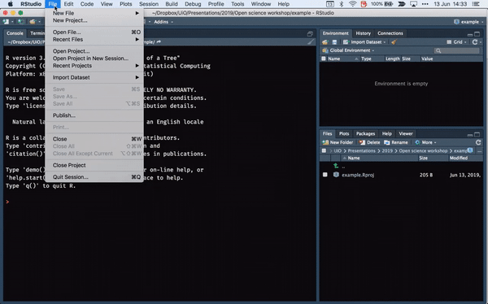
]]
.column.split-four.cyan[
.row[.content.vmiddle[
### `r emo::ji("arrow_left")` &nbsp; Go to the .amber.font-mono[File] menu > .amber.font-mono[New project...]
]]
.row[.content.vmiddle[
### `r emo::ji("file_folder")` &nbsp; Name your project in .amber.font-mono[Directory name].
]]
.row[.content.vmiddle[
### `r emo::ji("exclamation_mark")` &nbsp; Make sure to enter .amber.font-mono[gcushen/hugo-academic] as the Hugo theme.
]]
.row[.content.vmiddle[
### `r emo::ji("heavy_check_mark")` &nbsp; Keep all other options .amber.font-mono[the same].
]]
]
]
]]
.row.bg-cyan[.content.vmiddle[
### &emsp; `r emo::ji("100")` &nbsp; This will .amber[download all the necessary files] to create the backbone of your website.
]]
]

---
class: split-1-2-1

.row[.content.vmiddle.center[
# Creating an .amber["hugo"] website backbone
]]

--

.row.split-two.slide-in-left.cyan[
.row[.content.vmiddle[
### `r emo::ji("sparkles")` Load blogdown using the command .amber.font-mono[library(blogdown)]
]]
.row[.content.vmiddle[
### `r emo::ji("bone")` Install the "hugo" framework with .amber.font-mono[blogdown::install_hugo(force = TRUE)]
]]
]
.row[]
---
class: split-20

.row[.content.vmiddle.center[
# Building the .amber[template] of the website
]]

--

.row.split-70[
.row.slide-in-right.bg-cyan[.content[
.row.split-two[
.column[.content.nopadding[
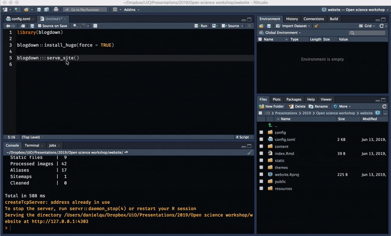
]]
.column.split-two[
.row[.content.vmiddle[
### &emsp; `r emo::ji("bowl")` &nbsp; Run the command .white[blogdown::serve_site()]
]]
.row[.content.v30[
### &emsp; `r emo::ji("eyes")` &nbsp; Run this command every time you want to check what your website will look like.
]]
]
]
]]
.row.split-two[
.row[.content.vmiddle[
### &emsp; `r emo::ji("calling")` &nbsp; This renders a mobile version of your site on the RStudio `viewer window`.
]]
.row[.content.vmiddle[
### &emsp; `r emo::ji("computer")` &nbsp; Copy-paste the `server address` into a web browser for a desktop version of your site.
]]
]
]

---
class: split-20

.row[.content.vmiddle.center[
# Let's .amber[customize] the website!
]]

.row.split-70[
.row.split-10.bg-amber[
.column[.content.center[
]]
.column.split-60[
.column[.content.center.nopadding[
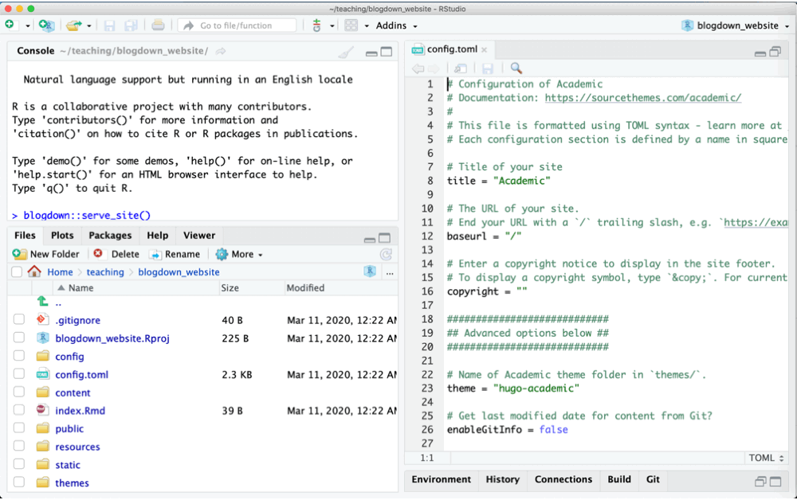
]]
.column[.content.center.vmiddle[
### `r emo::ji("pencil2")` &nbsp; .font-mono[You will do this by .cyan[editing the files on the project backbone].]
]]
]
]

--

.row.slide-in-left.bg-orange[.content.vmiddle.center[
### &emsp; `r emo::ji("point_up")` &nbsp; .font-mono[.amber[Open] any file by .amber[selecting] it from your .amber[file browser].]
]]
]

---
class: split-10

.row[.content.center.vmiddle[
## Controlling .blue[basic info] on your website.
]]

.row.split-60[
.row.split-two[
.column[.content.center[
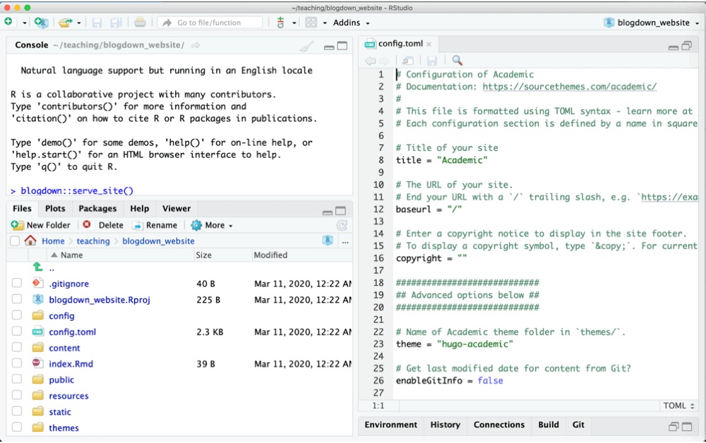
]]
.column[.content.center[

]]
]
.row.slide-in-right.split-25[
.column.bg-white[.content.v20.center[
## `r emo::ji("point_up")` Open the `config.toml` file and edit it to:
]]
.column.split-three.bg-light-blue[
.row[.content[
### &emsp; `r emo::ji("triangular_flag")` Change the `title` of your website.
]]
.row[.content[
### &emsp; `r emo::ji("link")` Add the `URL` of your site once you have one.
]]
.row[.content[
### &emsp; `r emo::ji("copyright")` Add a `copyright`. Just follow the instructions on the file.
]]
]
]
]
---
class: split-20

.row[.content.vmiddle.center[
# Control the .green[general appearance] of your website
]]

.row.split-two[
.column.split-25[
.row.bg-white[.content.vmiddle.center[
## `r emo::ji("point_down")` Files in the `config/_default` folder will allow you to:
]]
.row[.content.nopadding[
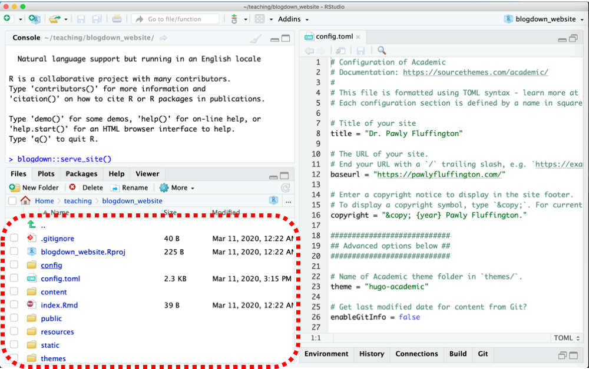
]]
]
.column.split-four[
.row.bg-teal[.content.vmiddle[
### `r emo::ji("hamburger")` &nbsp; Customize the website `menu`.
<!-- the elements of the menu and their order within the menu, as well as the menu's general position in the site. -->
]]
.row.bg-green[.content.vmiddle[
### `r emo::ji("mailbox_with_mail")`&nbsp;  Modify your `contact` information.
]]
.row.bg-lime[.content.vmiddle[
### `r emo::ji("art")` &nbsp; Set the color and font .white[theme] of the site in any way you want!
]]
.row.bg-light-green[.content.vmiddle[
### `r emo::ji("speech_balloon")` &nbsp; Configure the site in various .pink[languages] (Example website code [here]())
]]
]
]

---
class: split-20

.row[.content.vmiddle.center[
# Customize the website .teal[menu]
]]

.row.split-90[
.row.split-60.bg-teal[
.column[.content.nopadding.center.vmiddle[
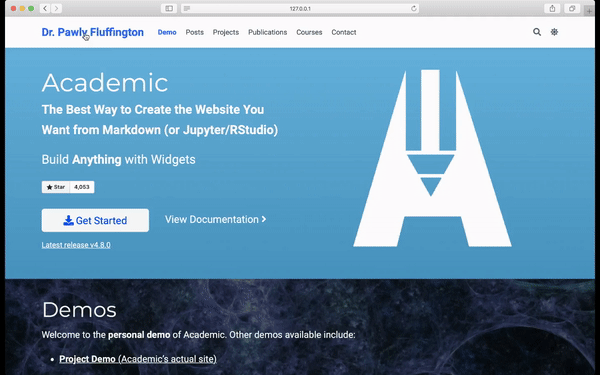
]]
.column.split-two[
.row[.content.vmiddle[
### `r emo::ji("point_left")` As you probably know, each element of the menu is a `link` that allows users to easily navigate across the content of a site `r emo::ji("sailboat")``r emo::ji("sailboat")``r emo::ji("sailboat")`
]]
.row[.content[
### You can control the .white[position] of the menu, its .white[content] and the .white[order] of its elements.
]]
]
.row[.content[
]]
]
]

---
class: split-60 teal

.column.split-two[
.row[.content.center.nopadding[
.pull-right[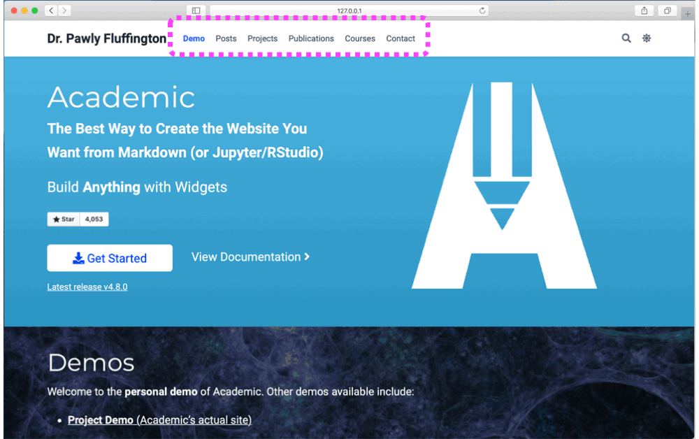]
]]
.row[.content.center.nopadding[
.pull-left[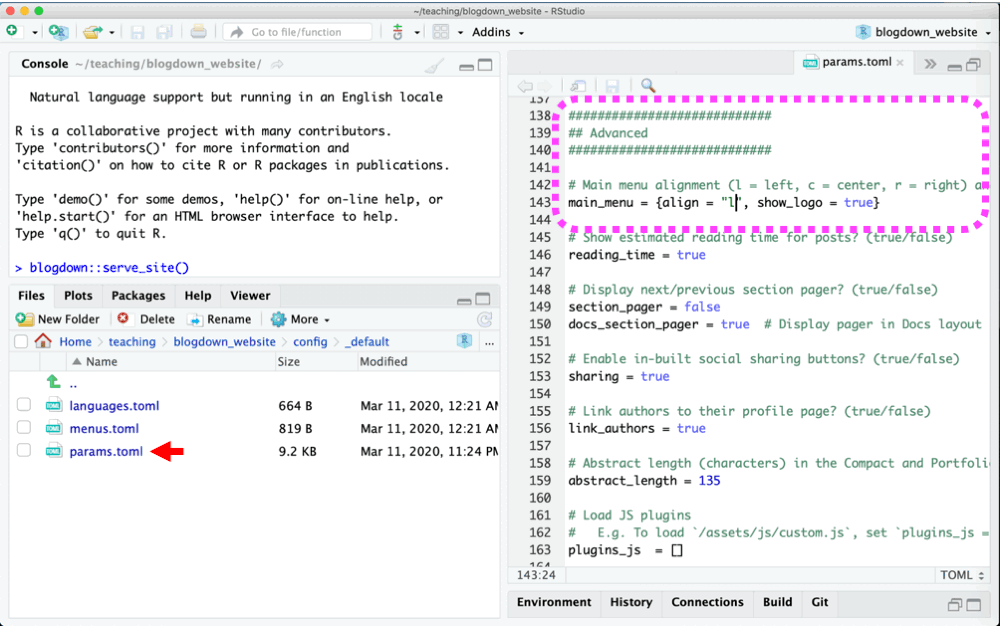]
]]
]

.column.split-two[
.row[.content.center.v30.black[
# Modifying the menu's .teal[position]
]]
.row.split-two.slide-in-right[
.row[.content.vmiddle.left[
### &emsp; `r emo::ji("point_left")` Go to the "Advanced" section of the `params.toml` file.
]]
.row[.content.vmiddle.left[
### &emsp; `r emo::ji("repeat")` And just change the `align` parameter.
]]
]
]

---
class: split-60 teal

.column.split-two[
.row[.content.center.nopadding[
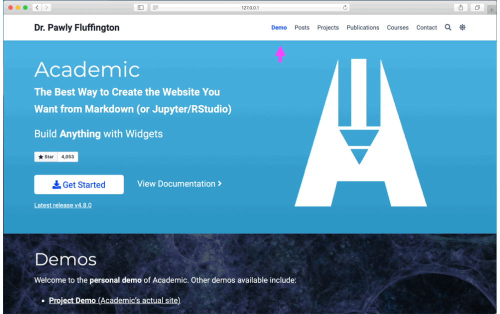
]]
.row[.content.center.nopadding[
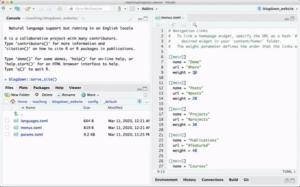
]]
]

.column.split-two[
.row[.content.center.v50.black[
# Modifying the .teal[order] of the menu's elements
]]
.row.split-two.slide-in-right[
.row[.content.vmiddle.left[
### `r emo::ji("point_left")` Go to the `menus.toml` file. Each section starting with "[[main]]" defines settings of a menu element.
]]
.row[.content.vmiddle.left[
### `r emo::ji("weight_lifting_man")` Change the `weight` parameter to modify the position of each element relative to other elements.
]]
]
]

---
class: split-60 teal

.column.split-two[
.row[.content.center.nopadding[
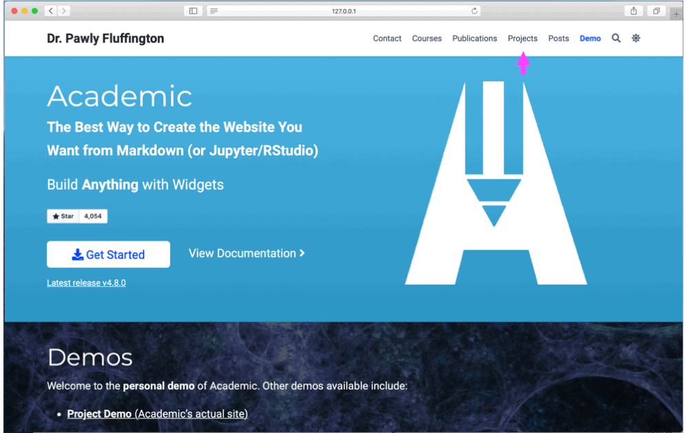
]]
.row[.content.center.nopadding[
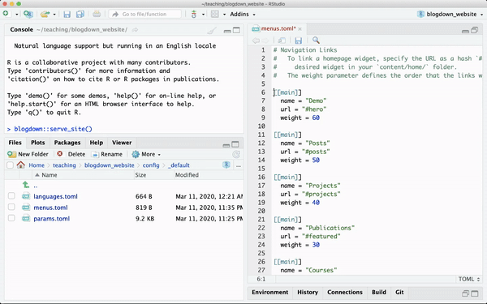
]]
]

.column.split-two[
.row[.content.center.v80.black[
# Modifying the menu's .teal[content]
]]
.row.split-three.slide-in-right[
.row[.content.vmiddle.right[
### .transp["]`r emo::ji("hash")` &nbsp; Also in the `menus.toml` file, place a `hashtag` symbol at the beginning of a line that defines an element you don't want in the menu
]]
.row[.content.vmiddle.right[
### `r emo::ji("pushpin")` &nbsp; This is known as `commenting out`
]]
.row[.content.vmiddle.right[
### `r emo::ji("cupcake")` &nbsp; Extra: Change the `name` argument and see what happens.
]]
]
]


---
class: bg-white split-20

.row[.content.center.vmiddle[
## Modifying your .green[contact information]
]]

.row.split-70[
.row.split-two[
.column[.content.center[
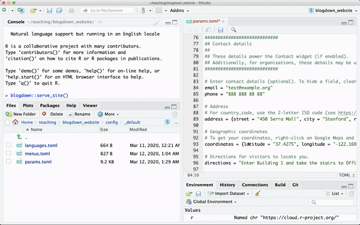
]]
.column[.content.center[
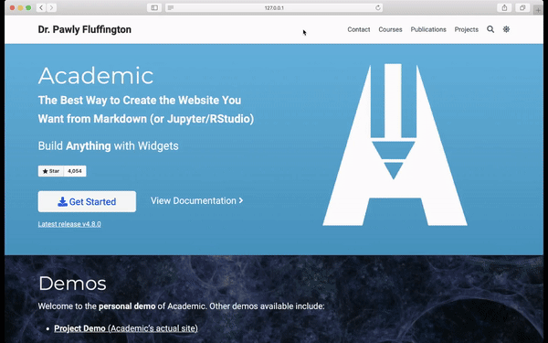
]]
]
.row.slide-in-right.split-two[
.column.bg-white[.content.v20.center[
## `r emo::ji("point_up")` Go to the .green[Contact details] section of `params.toml`
]]
.column.bg-green[
.content.v45.center[
##  And simply edit it with your own information `r emo::ji("stuck_out_tongue_winking_eye")`
]
]
]
]
---
class: bg-white split-20

.row[.content.center.vmiddle[
## Customizing the .lime[font and color] themes!
]]

.row.split-70[
.row.split-two[
.column[.content.center[
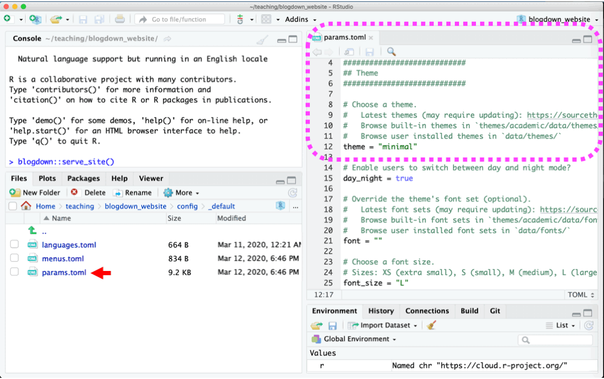
]]
.column[.content.center[
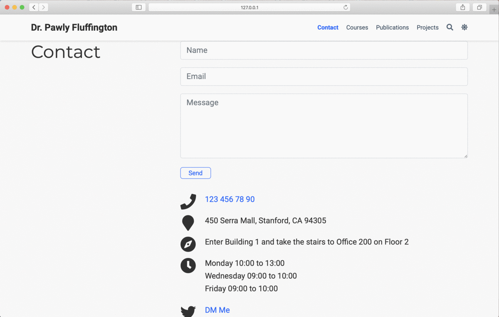
]]
]
.row.slide-in-right.split-two[
.column.bg-white[.content.v20.center[
## `r emo::ji("point_up")` Go to the .lime[Theme] section of `params.toml`
]]
.column.bg-lime[
.content.v45.left[
##  And modify the .white[theme] argument `r emo::ji("man_artist")` `r emo::ji("woman_artist")`
]
]
]
]


---
class: split-20

.row[.content.vmiddle.center[
# Add .color-main4[content] to your website
]]

.row.split-two[
.column.split-25[
.row.bg-white[.content.vmiddle.center[
## Files in the `r emo::ji("point_down")` `content/` `r emo::ji("point_down")` folder will allow you to:
]]
.row[.content.nopadding[
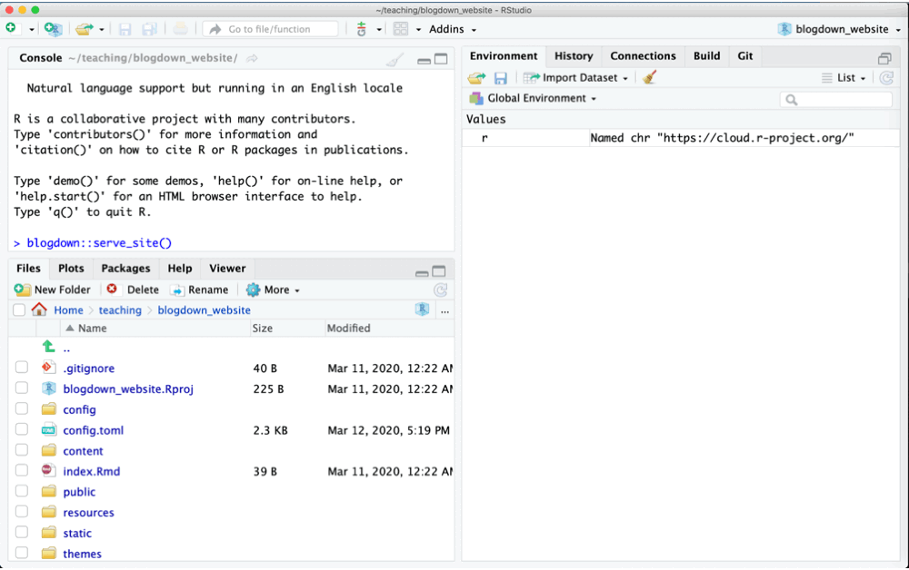
]]
]
.column.split-three[
.row.bg-main4.black[.content.vmiddle[
### `r emo::ji("test_tube")` `r emo::ji("telescope")` `r emo::ji("microscope")` &nbsp; Edit yours and your colleagues' .white[bios].
]]
.row.bg-main1.white[.content.vmiddle[
### &nbsp;.amber[Design] the .amber[content] of your home &nbsp; `r emo::ji("man_construction_worker")` `r emo::ji("house")` `r emo::ji("woman_construction_worker")`
]]
.row.bg-main2.black[.content.vmiddle[
### `r emo::ji("nerd")` &nbsp; Add your .white[work:] courses, blogposts, projects, publications, tutorials and talks.
]]
]
]
---
class: split-60 color-main4

.column.split-two[
.row[.content.center.nopadding[
.pull-right[]
]]
.row[.content.center.nopadding[
.pull-left[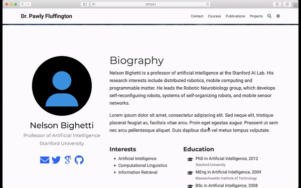]
]]
]

.column.split-20[
.row.bg-main3[.content.center.v30.black[
.font2[Adding your .white[bio] into] .font1-85.white[content/authors/admin/]
]]
.row.split-four.slide-in-right.font_medium[
.row[.content.v20.left[
`r emo::ji("camera_flash")` &nbsp; Add or update a `profile photo` by saving it into this folder. `r emo::ji("warning")` Name the file `avatar.jpg`.]]
.row[.content.v20.left[
`r emo::ji("mortar_board")` &nbsp; Edit your `biography` details (e.g, position, affiliation, education details) in the `_index.md` file.
]]
.row[.content.v20.left[
`r emo::ji("tropical_drink")` &nbsp; Add your `social media` details and a link to your Google Scholar profile page, also in `_index.md`.
]]
.row[.content.left[
`r emo::ji("handshake")` &nbsp; .font0-75[Add a colleague's bio: Make a new folder into `content/authors/`. Name it whatever you want, but it has to have the files `_index.md` and `avatar.jpg`.]
]]
]
]

---
class: split-20

.row[.content.vmiddle.center[
# Design the .color-main3[content] of your home page `r emo::ji("house")`
]]

.row.split-90[
.row.split-60.bg-main1[
.column[.content.nopadding.center.vmiddle[
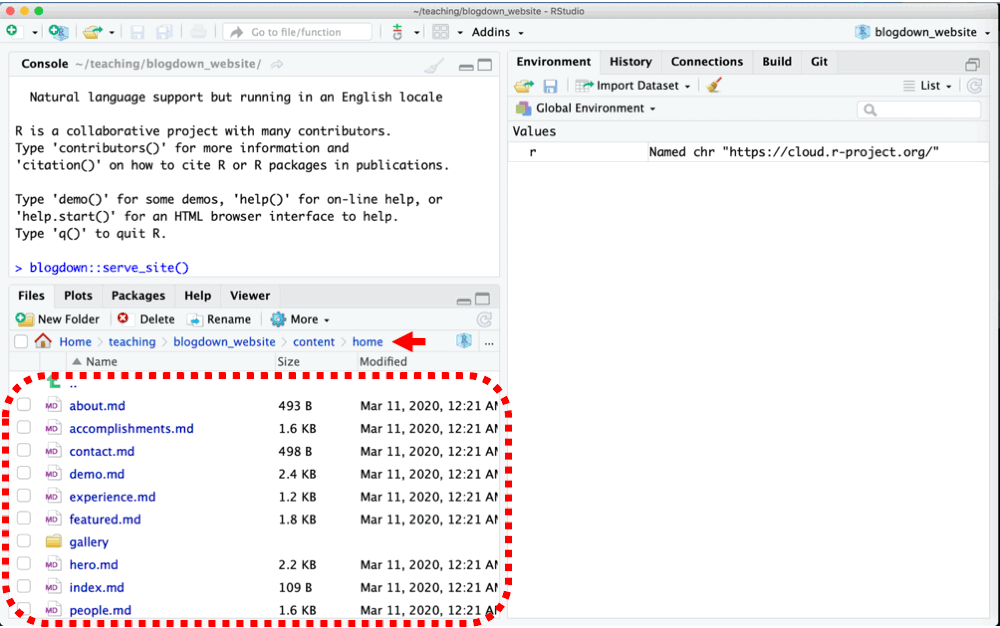
]]
.column.split-10.center[
.row[.content.font0-85[
Most content of a website lives in the home page.
]]
.row.split-four[
.row[.content.v10.color-main4[
It is easier to identify different parts of your website when each has its own personality or .amber[design].
]]
.row[.content.font_medium[
Different ways of presenting content are called .amber[widgets].
]]
.row[.content.color-main4[
`r emo::ji("point_left")` &nbsp;
.font1-5[Each `".md"` file within the folder `content/home/` represents a different widget.]
]]
.row[.content.v50[
Go to [Hugo Academic's documentation](https://sourcethemes.com/academic/docs/page-builder/) for more details on widgets.
]]
]
]
.row[.content[
]]
]
]

---
class: split-60 purple

.column.split-two[
.row[.content.center.nopadding[
.pull-right[]
]]
.row[.content.center.nopadding[
.pull-left[]
]]
]

.column.split-two[
.row[.content.center.v30.black[
# .purple[Adding] or .purple[removing] a widget from home
]]
.row.split-two.slide-in-right[
.row[.content.center[
### &nbsp; `r emo::ji("point_left")` &nbsp; Open up the `.md` file of the widget you want to remove.
]]
.row[.content.v20.center[
### &emsp; `r emo::ji("eyes")` &nbsp; And just change
### `active=true` to `active=false`.
]]
]
]

---

class: split-60 purple

.column.split-two[
.row[.content.center.nopadding[
.pull-right[]
]]
.row[.content.center.nopadding[
.pull-left[]
]]
]

.column.split-two[
.row[.content.center.v60.black[
# .purple[Duplicating] a widget in the home
]]
.row.split-two.slide-in-right[
.row[.content.center[
### &nbsp; `r emo::ji("point_left")` &nbsp; Select the `.md` file of the widget you want to duplicate
]]
.row[.content.v20.center[
### &emsp; `r emo::ji("dancers")` &nbsp; And simply duplicate the file into the same folder (`content/home/`).
]]
]
]

---
class: split-20

.row[.content.vmiddle.center[
# Add .purple[results] from your work
]]

.row.split-90[
.row.split-60.bg-main2[
.column[.content.nopadding.center.vmiddle[

]]
.column.split-two[
.row[.content.vmiddle[
### `r emo::ji("point_left")` &nbsp; Widgets in the home link to your work. This is stored in folders within the `content/` folder.
]]
.row[.content[
### &nbsp; The folders `courses/`, `posts/`, `projects/`, `publications/`, `slides/` and `talks/` are preset, but you can add as many sections as you need `r emo::ji("open_file_folder")``r emo::ji("card_file_box")``r emo::ji("file_cabinet")`
]]
]
.row[.content[
]]
]
]

---
class: left,  middle

.center[Last but not least, add a PDF of your CV]

<br/><br/><br/>

Simply copy your CV to `static/files/cv.pdf`

Then, uncomment, --remove the hashtag "#" signs at the beginning of the lines of the CV section in `config/_default/_menus.toml` file.

---
class: left,  middle

Bonus!

Modify the mini-logo on the browser

<br/><br/><br/>


---

```{r child='unix_shell_break_2019.11.14.Rmd'}
```
