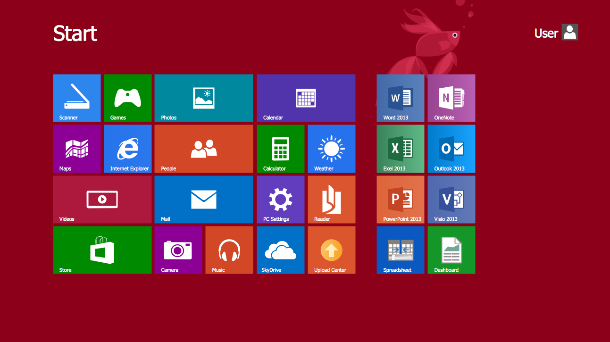
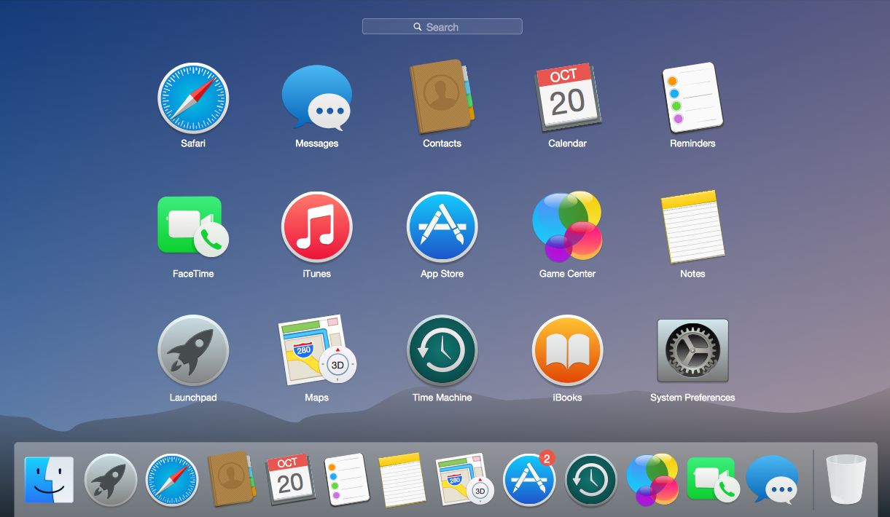

class: section-start, center

##Introduction to the **Shell**

<br/><br/>

```{r, out.width = "450px"}

```

---
class: center

background-image: url("media/computer-parts.jpg")
background-position: top
background-size: contain

---

.pull-left[
# A Graphic User Interface (GUI)

]


.pull-right[

.transp[some space]

]


---
class: center

background-image: url("https://media.giphy.com/media/12Um5HJXAnXGNy/giphy.gif")
background-position: 50% 65%
background-size: 700px 

## This is Nelle (aka Sandy Cheeks)

---
class: center

background-image: url("media/nelle-jellyfish.jpg")
background-position: 50% 65%
background-size: 480px 

## This is Nelle (aka Sandy Cheeks)

---
class: center

background-image: url("https://media.giphy.com/media/l1EteWDVzSLSwtPtm/giphy.gif")
background-position: 50% 50%
background-size: 900px 

---

.center[#Use the Unix **Shell** !]

--

<br/><br/>

.tab[###It is a Command Line Interface (CLI)]


--

<br/><br/>

###and a scripting language

---
class: center

background-image: url("https://media.giphy.com/media/iH8CH8tg1AG3LGxTyJ/giphy.gif")
background-position: 50% 70%
background-size: 800px 

# It will take time and effort to learn **Shell** commands and vocabulary...

---

# But it is worthy!

--

<br/><br/>

##What can the **Shell** do for you??

- Run complicated software automatically
<br/><br/>
- Combine existing software into pipelines
<br/><br/>
- Handle huge volumes of data rapidly
<br/><br/>
- Improve reproducibility
<br/><br/>
- Interact remotely with computers and clusters
<br/><br/>
- Run specialized resources (e.g., high-performance computing systems)

---

#Let's get started!

---

##The prompt

<br/>

#$ 

#%

#>

<h1>#</h1>

<br/>

Do not type the prompt symbol along with your commands.

---

## Time for your first command (maybe...)


<br/><br/>


# - List the content of your current directory with `ls`


