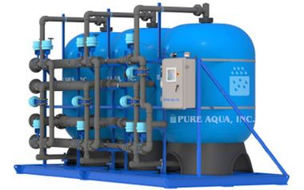

class:center, section-start

# The Unix **Shell**

## Pipes and Filters

<br/><br/>

```{r, out.width = "450px"}

```

---

## Combinining existing programs in new ways

<br/><br/>

# - Use `wc` to explore files within `molecules/`

---

## Redirect the output of a command into a file

<br/><br/>

# - Use the symbol `>`

<br/><br/>

---

## Display the content of a file

# - Use `cat` and `less`

---

## Sort

Remember: Do not redirect an output to itself while you are operating on it.

---

## Append with the symbol `>>`

---

## Link commands with the symbol `|`
