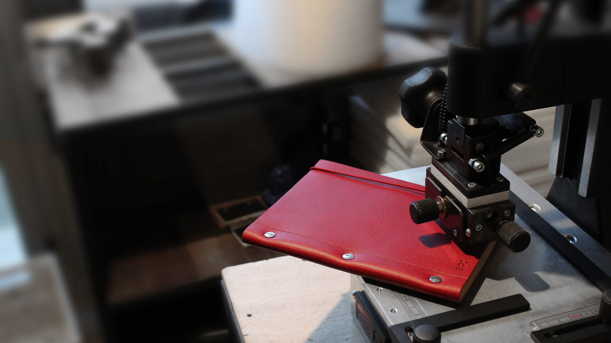

class:center, section-start

# The Unix **Shell**

## Working With Files and Directories

<br/><br/>

```{r, out.width = "450px"}

```

---

## Create a file from the **Shell**

<br/><br/>

# - The command we need is `mkdir`

---

## Create a file

<br/><br/>

# - with a text editor

# - using the `touch` command

---

## Move files and dirs

<br/><br/>

# - using the `mv` command

---

## Copy files and dirs

<br/><br/>

# - using the `cp` command

---

## Deleting files and dirs

<br/><br/>

# - using the `rm` command

<br/><br/>

Remember: deleting in the Shell is *forever*

---

## Working with multiple files and dirs at once

<br/><br/>

# - wildcards


